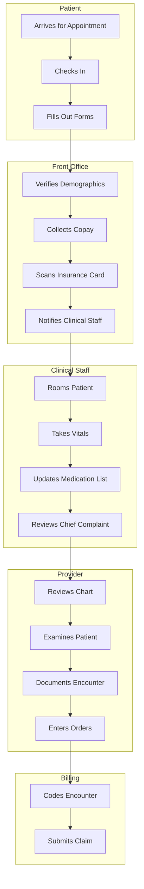

Implementing an EHR system is not simply a matter of replacing paper charts with computers. It requires a fundamental redesign of clinical workflows. If you automate a bad process, you simply get a faster bad process.

## Why Workflow Redesign Matters

EHR implementation without workflow redesign leads to:

```yaml
Common Problems Without Workflow Redesign:
  └─ "Workaround" behaviors: Staff bypass the EHR because it does not fit their process
  └− Productivity loss: 20-40% drop in patient volume during transition
  └− Provider burnout: Excessive clicking, documentation burden
  └− Safety risks: Alert fatigue, missing information, wrong patient selection
  └− Staff frustration: Resistance to EHR adoption, increased turnover
  └− Underutilized features: Paying for capabilities that no one uses
  └− Duplicate documentation: Entering same data in multiple places

Cost of Poor Workflow Design:
  └− Extra clicks: Each unnecessary click costs 1-2 seconds × hundreds of encounters
  └− Extended visit time: Average 1-2 minutes longer per visit with poor workflow
  └− After-hours charting: Providers spend 1-2 hours/night on incomplete documentation
  └− Lost revenue: 2-4 fewer patients per day due to inefficient workflows
```

## Workflow Analysis Methodology

### Phase 1: Document Current State ("As-Is")

```yaml
Step 1: Identify Key Workflows
  └− Patient check-in → rooming → provider encounter → check-out → billing
  └− Medication refill process
  └− Lab order → result → provider review → patient notification
  └− Referral to specialist → referral completion
  └− Hospital discharge → PCP follow-up

Step 2: Gather Data
  └− Shadow staff: Observe current processes (2-3 days per role)
  └− Interview stakeholders: What works? What is broken?
  └− Time-motion studies: How long does each step take?
  └− Collect forms: Paper forms, superbills, routing slips
  └− Identify pain points: Where are the bottlenecks?

Step 3: Create Process Maps
  └− Swimlane diagrams showing each role's steps
  └− Decision points and handoffs
  └− Paper vs. electronic data flows
  └− Identify: Value-added vs. non-value-added steps
```

### Swimlane Diagram Example



### Phase 2: Design Future State ("To-Be")

```yaml
Design Principles:
  └− Minimize clicks: Every click should add clinical value
  └− Reduce handoffs: Eliminate unnecessary transfers between staff
  └− Automate where possible: Use templates, defaults, interfaces
  └− Distribute intelligently: Right work to right person
  └− Design for safety: Prevent errors through system design
  └− Mobile-friendly: Support documentation at the point of care
  └− Voice-friendly: Support dictation for hands-free documentation

Design Process:
  1. Identify waste: What steps add no value?
  2. Brainstorm improvements: How can EHR eliminate waste?
  3. Prototype new workflow: Walk through with key stakeholders
  4. Test with simulation: Run through scenarios
  5. Refine: Adjust based on feedback
  6. Document: Create workflow documentation and training materials
```

## Key EHR Workflow Improvements

| Paper Workflow | EHR Workflow | Improvement |
|----------------|--------------|-------------|
| Patient fills out paper forms in waiting room | Patient completes forms via portal before visit | Saves 10-15 minutes per patient |
| Staff manually pulls paper charts | Chart opens automatically when patient checks in | Saves 5-10 minutes per patient |
| Handwritten prescriptions | E-prescribing with drug interaction check | Reduces errors by 48-81% |
| Paper lab orders → fax to lab → manual result entry | Electronic lab orders → auto-result import | Eliminates 3-5 handoffs |
| Dictation → transcription → sign paper note | Voice recognition → sign electronically | Saves 24-48 hours turnaround |
| Manual superbill coding | EHR suggests codes based on documentation | Improves coding accuracy |
| Paper referral → fax — phone follow-up | Electronic referral with closed-loop tracking | Confirms referral completion |

## Common Workflow Redesigns

### 1. Check-In Process

```yaml
Paper-Based Check-In:
  └− Patient arrives → hands paper form to front desk
  └− Staff manually enters demographics into PMS
  └− Staff photocopies insurance card
  └− Staff collects copay → manual receipt
  └− Staff pulls paper chart → places in rack
  └− Time: 5-10 minutes

EHR-Enabled Check-In:
  └− Patient checks in via kiosk or front desk
  └− Demographics verified against EHR (updated via portal before visit)
  └− Insurance card scanned into EHR
  └− Copay collected → electronic receipt → auto-posts to ledger
  └− EHR flags patient as "arrived" → chart ready for clinical staff
  └− Time: 2-4 minutes
  └− Kiosk check-in: 1-2 minutes, no staff time needed
```

### 2. Medication Reconciliation

```yaml
Paper-Based Med Rec:
  └− Patient writes medications on form (often incomplete)
  └− Staff types medications into billing system (no clinical data)
  └− Provider asks "Are you still taking all these?" (ineffective)
  └− No drug interaction checking
  └− Time: 3-5 minutes (patient) + 2 minutes (staff) + 2 minutes (provider)

EHR-Enabled Med Rec:
  └− Patient updates medication list via portal before visit
  └− EHR compares current list to prescribed medications
  └− Discrepancies flagged for provider review
  └− Drug interaction check automatically runs
  └− Provider reconciles discrepancies with patient
  └− Time: Patient (5 min via portal) + Provider (1-2 minutes)
```

### 3. Referral Management

| Step | Paper Workflow | EHR Workflow |
|------|---------------|--------------|
| Referral creation | Handwritten or typed referral letter | Electronic referral order with attached records |
| Referral transmission | Faxed or mailed to specialist | Electronic transmission via HIE or direct messaging |
| Appointment scheduling | Patient calls specialist (requires referral info) | Integrated scheduling or portal-based scheduling |
| Specialist documentation | Dictated/transcribed — mailed to PCP | Electronic consult note returned to PCP via EHR |
| Referral tracking | Manual follow-up (often incomplete) | Automated tracking — closes loop when consult received |
| Patient compliance | No tracking | Automated reminders, status tracking |

## Avoiding Workflow Pitfalls

| Pitfall | Description | Prevention |
|---------|-------------|------------|
| **Automating Bad Processes** | Implementing EHR without changing broken workflows | Document and redesign workflows BEFORE EHR configuration |
| **One-Size-Fits-All** | Single workflow for all specialties and settings | Design flexible workflows specific to each clinical area |
| **Over-Customization** | Too many templates, alerts, and required fields | Balance data needs with efficiency — start simple |
| **Ignoring Input** | Not involving end-users in design | Include physicians, nurses, MAs in workflow design sessions |
| **Training Too Late** | Teaching workflows after the system is built | Train on workflows concurrently with system build |
| **No Feedback Loop** | Not adjusting workflows post go-live | Establish ongoing workflow optimization committee |

## Key Takeaways

- EHR implementation requires fundamental workflow redesign — automating a bad process creates a faster bad process
- Poor workflow design leads to productivity loss (20-40%), provider burnout, safety risks, and underutilized EHR features
- Workflow redesign follows a structured methodology: document current state ("As-Is") → design future state ("To-Be") → implement → optimize
- Process mapping with swimlane diagrams clarifies each role's responsibilities and identifies waste
- Key EHR workflow improvements include: portal-based check-in, e-prescribing, automated lab interfaces, electronic referrals, and integrated medication reconciliation
- Common workflow redesigns for check-in can reduce patient wait time from 5-10 minutes to 1-2 minutes
- Pitfalls to avoid: automating bad processes, one-size-fits-all workflows, over-customization, and ignoring end-user input
- Workflow optimization should continue post go-live through a continuous improvement process
- The goal is to reduce clicks, eliminate waste, and let providers focus on patient care rather than data entry
