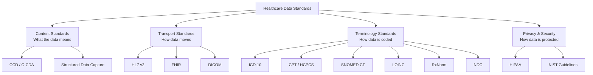

Healthcare data standards are the backbone of EHR interoperability. Without them, health information would be trapped in proprietary formats, unable to move between systems or be understood by different providers. These standards ensure that data is structured, coded, and transmitted in consistent ways across the entire healthcare ecosystem.

## Why Data Standards Matter

```yaml
Without Standards:
  └─ Every EHR system stores data in its own format
  └─ One system's "heart attack" is another's "myocardial infarction" or "MI"
  └─ Lab results cannot be automatically interpreted across systems
  └─ Medications cannot be checked for interactions without common identifiers
  └─ Public health reporting requires manual data extraction
  └─ Patients cannot easily move their records between providers

With Standards:
  └─ Data is structured consistently across all systems
  └─ "Myocardial infarction" maps to SNOMED code 22298006 in any system
  └─ Lab LOINC codes identify the test; result values use standard units
  └─ RxNorm identifies medications across manufacturers and naming systems
  └─ ICD-10 codes enable consistent diagnosis classification for billing
  └─ FHIR APIs enable modern app-based data exchange
```

## Categories of Healthcare Standards



## Terminology Standards

### ICD-10 (International Classification of Diseases, 10th Revision)

The standard for diagnosis coding used worldwide:

```yaml
Purpose: Classify diseases, symptoms, and external causes of injury
Used For: Diagnosis coding for billing, epidemiology, and quality measurement
Structure: 
  └─ 3-7 characters: Category + Etiology + Anatomy + Extension
  └─ Example: E11.9 = Type 2 diabetes mellitus without complications
  └─ 68,000+ codes (up from 13,000 in ICD-9)
  
Code Structure:
  └─ First 3 characters: Category of disease
  └─ Next 3 characters: Etiology, anatomic site, severity
  └─ 7th character: Extension (initial encounter, subsequent, sequela)

Examples:
  └─ I10: Essential (primary) hypertension
  └─ J45.909: Unspecified asthma, uncomplicated
  └─ S82.001A: Fracture of patella, initial encounter for closed fracture
  └─ Z23: Encounter for immunization
```

### CPT (Current Procedural Terminology)

The standard for coding medical procedures and services:

| Category | Description | Examples |
|----------|-------------|----------|
| **Category I** | Procedures and services | 99213 (Office visit, established patient) |
| **Category II** | Performance measurement | 4000F (Blood pressure measured) |
| **Category III** | Emerging technology | 0501T (Remote patient monitoring) |
| **Proprietary** | Specific lab analyses | 0001M (Proprietary lab analysis) |

```yaml
CPT Code Structure:
  └─ 5-digit numeric code
  └─ Modifier: 2-digit extension for special circumstances
  └─ Example: 99213-25 = Office visit with significant, separately identifiable E/M
  
Common Evaluation and Management (E/M) Codes:
  └─ 99201-99205: New patient office visits
  └─ 99211-99215: Established patient office visits
  └─ 99221-99223: Initial hospital care
  └─ 99231-99233: Subsequent hospital care
```

### SNOMED CT (Systematized Nomenclature of Medicine — Clinical Terms)

The most comprehensive clinical terminology standard:

| Aspect | Description |
|--------|-------------|
| **Purpose** | Comprehensive clinical terminology for electronic health records |
| **Size** | 350,000+ concepts |
| **Structure** | Concepts + Descriptions + Relationships |
| **Coverage** | Diseases, procedures, symptoms, body structures, organisms, substances |
| **Example** | 22298006 \| Myocardial infarction (disorder) \| IS-A: 414545008 (Ischemic heart disease) |
| **Use** | Clinical documentation, decision support, data analytics |

**SNOMED CT Example Hierarchy:**
```
Disease (Concept)
  → Cardiovascular disease
    → Ischemic heart disease
      → Myocardial infarction
        → Acute myocardial infarction
          → ST elevation MI
          → Non-ST elevation MI
```

### LOINC (Logical Observation Identifiers Names and Codes)

The standard for laboratory and clinical observations:

| Component | Description |
|-----------|-------------|
| **Purpose** | Identify lab tests, clinical measurements, and observations |
| **Size** | 90,000+ codes |
| **Structure** | 6-part name: Component, Property, Timing, System, Scale, Method |
| **Examples** | 4548-4 (Hemoglobin A1c), 6690-2 (WBC count), 8480-6 (Systolic blood pressure) |
| **Use** | Lab results reporting, clinical measurements, vital signs |

```yaml
LOINC Example — Hemoglobin A1c:
  └─ LOINC Code: 4548-4
  └─ Component: Hemoglobin A1c
  └─ Property: Mass fraction
  └─ Timing: Point in time
  └─ System: Blood
  └─ Scale: Quantitative
  └─ Method: HPLC (optional specific method)
```

### RxNorm

The standard for medication terminology:

```yaml
Purpose: Provide normalized names for clinical drugs
Developed by: National Library of Medicine
Structure:
  └─ Ingredient → Brand Name → Clinical Drug → Dose Form
  └─ Links to NDC (National Drug Code) for packaging

Example — Tylenol 500mg Tablet:
  └─ IN (Ingredient): Acetaminophen
  └─ SCD (Semantic Clinical Drug): Acetaminophen 500mg Oral Tablet
  └─ SBD (Semantic Branded Drug): Tylenol 500mg Oral Tablet
  └─ NDC: 50580-449-01
```

## Transport Standards

### HL7 Version 2 (HL7 v2)

The most widely implemented healthcare messaging standard:

```yaml
Type: Messaging standard for healthcare data exchange
Version: HL7 v2.x (v2.3, v2.3.1, v2.4, v2.5, v2.6)
Format: Delimited text (pipe and caret delimited)
Messages: ADT (Admission/Discharge/Transfer), ORM (Orders), ORU (Results), etc.

Example HL7 v2 ADT Message (Patient Admit):
  MSH|^~\&|HOSPITAL|LAB|RECEIVER|APP|202603151430||ADT^A01|MSG001|P|2.5
  EVN|A01|202603151430|||(lab technician)
  PID|1||PATID123||DOE^JOHN^Q||19800115|M|||123 Main St^Metropolis^IL^60000||(555)555-1234|||S|(patient)
  NK1|1|DOE^JANE^M|SPOUSE|(555)555-5678
  PV1|1|I|ER^ER01^A|E|er_attend^^^ER MD|||attending_phys|||||||ER_ADMIT|visit123|||||||||||||||||||||||||||202603151430
```

### FHIR (Fast Healthcare Interoperability Resources)

The modern, web-based standard for healthcare data exchange:

```yaml
Type: RESTful API standard for healthcare data
Version: FHIR R4, R5 (current)
Format: JSON or XML
Transport: HTTPS (standard web protocols)

Key Features:
  └─ RESTful API — works like modern web APIs
  └─ Resources — modular data components (Patient, Observation, Medication, etc.)
  └─ SMART on FHIR — enables app ecosystem
  └─ Required by 21st Century Cures Act
  └─ Patient-facing apps can access EHR data via FHIR

Example FHIR Patient Resource (JSON):
  {
    "resourceType": "Patient",
    "id": "example",
    "name": [{"family": "Doe", "given": ["John"]}],
    "gender": "male",
    "birthDate": "1980-01-15"
  }

Example FHIR Observation (Blood Pressure):
  {
    "resourceType": "Observation",
    "code": {"coding": [{"system": "http://loinc.org", "code": "85354-9"}]},
    "valueQuantity": {"value": 120, "unit": "mmHg", "system": "http://unitsofmeasure.org"}
  }
```

### DICOM (Digital Imaging and Communications in Medicine)

The standard for medical imaging:

```yaml
Purpose: Store, transmit, and display medical images
Supported Modalities: X-ray, CT, MRI, Ultrasound, PET, Mammography
Components:
  └─ File format: .dcm (image + metadata)
  └─ Network protocol: DICOM Communication for transmission
  └─ Workflow: Modality Worklist, MPPS, Storage Commitment

Key Capabilities:
  └─ Image pixel data + patient demographics + study metadata
  └─ Window/level settings for optimal viewing
  └─ Structured reports (measurements, findings)
  └− Integration with EHR via HL7/FHIR
```

## Content Standards

### CCD (Continuity of Care Document)

The standard for patient summary exchange:

```yaml
Purpose: Summarize patient's health status for transitions of care
Format: XML (based on HL7 CDA — Clinical Document Architecture)
Content Sections:
  └─ Allergies and adverse reactions
  └─ Medications
  └─ Problems (active diagnoses)
  └− Immunizations
  └− Vital signs
  └− Lab results
  └− Procedures
  └− Care plan / future appointments

Use Case: Hospital discharges to primary care, specialist referrals
```

## Standard Adoption in Practice

| Standard | EHR Certification Requirement | Adoption Rate |
|----------|------------------------------|---------------|
| **HL7 v2** | Yes (transport) | 95%+ of EHR systems |
| **FHIR** | Required for 2015 Edition (2017) | 80%+ of certified EHRs |
| **ICD-10** | Required for billing | Mandatory (US) |
| **CPT** | Required for billing | Mandatory (US) |
| **SNOMED CT** | Required for problem lists (MU) | 90%+ certified EHRs |
| **LOINC** | Required for lab results | 85%+ of lab interfaces |
| **RxNorm** | Required for medication lists | 90%+ of EHRs |
| **DICOM** | Required for imaging | Universal in PACS |
| **C-CDA** | Required for transitions | 85%+ certified EHRs |

## Key Takeaways

- Healthcare data standards ensure that health information can be understood, transmitted, and processed consistently across different systems and organizations
- **Terminology standards** define the meaning of data: ICD-10 (diagnoses), CPT (procedures), SNOMED CT (clinical concepts), LOINC (lab tests), RxNorm (medications)
- **Transport standards** define how data moves: HL7 v2 (legacy messaging), FHIR (modern RESTful APIs), DICOM (medical imaging)
- **Content standards** define what is included: CCD/C-CDA (patient summary for care transitions)
- FHIR is the most significant recent development — it uses modern web standards (REST, JSON) and enables patient-facing apps to access EHR data
- The 21st Century Cures Act mandates FHIR API access and prohibits information blocking
- EHR certification requires support for most major standards, ensuring baseline interoperability
- Without these standards, health information would be trapped in proprietary systems — standards are what make EHRs truly valuable
