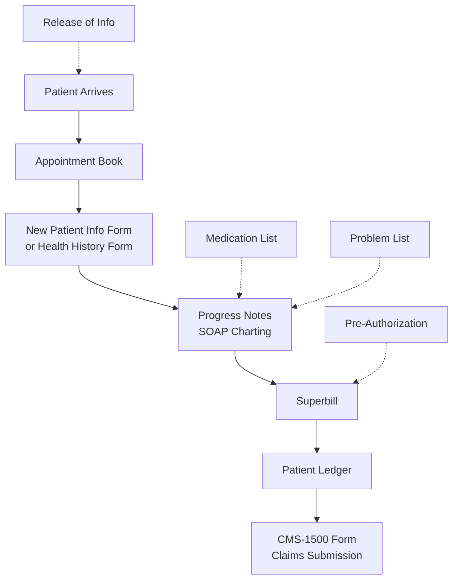

Before the widespread adoption of electronic health records, healthcare facilities operated entirely on paper-based systems. Understanding these traditional procedures is essential — not only do they form the foundation that EHR systems were designed to improve, but many of these processes have direct digital equivalents in modern EHR software.

## Overview of Paper-Based Workflow

In a paper-based healthcare facility, staff members use different tools to follow similar procedures. Understanding each tool and its purpose is essential for healthcare professionals:



## Traditional Paper Tools and Forms

### 1. Appointment Book

The appointment book contains an **appointment matrix** where doctors' or providers' schedules are found. The medical assistant relays the available time and day to the patient and records:

- Patient's name and date of birth
- Reason for visit (chief complaint)
- Contact phone number
- Insurance information
- Whether the patient is new or established

```yaml
Appointment Book Features:
  └─ Matrix layout showing time slots per provider
  └─ Color coding or symbols for appointment types
     (e.g., new patient, follow-up, procedure)
  └─ Double-booking notation
  └─ Cancellation and no-show tracking
  └─ Wait list notations

Scheduling Methods:
  └─ Fixed Scheduling: Patient assigned a specific date and time
  └─ Wave Scheduling: Multiple patients scheduled at the same hour
     seen in order of arrival
  └─ Modified Wave: Two patients scheduled at the top of the hour,
     single patients at 30-minute intervals
  └─ Open Hours: Patients arrive within a block of time
  └─ Double Booking: Two patients scheduled for the same time slot
```

### 2. New Patient Information Form

This form is given to new patients to gather basic information:

| Section | Information Collected |
|---------|---------------------|
| **Personal Information** | Full name, date of birth, gender, SSN, address, phone number |
| **Emergency Contact** | Name, relationship, phone number |
| **Insurance Information** | Carrier name, policy/group number, subscriber name |
| **Guarantor Information** | Person financially responsible (if different from patient) |
| **Medical History Summary** | Brief overview of current health concerns |
| **Pharmacy Information** | Preferred pharmacy name and address |

The patient can fill out the required details before arrival or complete the form upon arrival. Once complete, the medical assistant checks the form and requests the patient to provide a copy of their insurance card. This form is then filed in the patient's medical record.

### 3. Patient Health History Form

The patient may complete this history form prior to their arrival. It is more detailed than the new patient form and includes:

```yaml
Health History Contents:
  └─ Past medical history (chronic conditions, hospitalizations, surgeries)
  └─ Family medical history (parents, siblings, children)
  └─ Social history (smoking, alcohol, exercise, occupation)
  └─ Current medications and dosages
  └─ Known allergies and reactions
  └─ Immunization history
  └─ Review of systems (head-to-toe symptom checklist)
  └─ Obstetric/Gynecologic history (for female patients)

Process:
  └─ Patient completes form (paper or pre-visit)
  └─ Medical assistant reviews for completeness
  └─ Forms filed in the patient's medical record
  └─ Provider reviews and updates at each visit
```

### 4. Progress Notes (SOAP Charting)

The documentation of the patient's vital signs, chief complaint, height, and weight are taken in the progress notes using **SOAP charting**:

| SOAP Component | Description | Example |
|----------------|-------------|---------|
| **S — Subjective** | What the patient says — chief complaint, history of present illness, pain level, symptom description | "I've had a headache for three days, mostly in the front of my head. It's a 6/10 pain." |
| **O — Objective** | What the provider observes and measures — vital signs, physical exam findings, test results | BP 138/88, HR 78, Temp 98.6°F. Tender to palpation over frontal sinuses. |
| **A — Assessment** | The diagnosis or differential diagnosis based on subjective and objective data | Allergic rhinitis vs. sinusitis. Likely acute sinusitis. |
| **P — Plan** | Treatment plan — medications, referrals, follow-up, patient education | Prescribe amoxicillin 875mg BID x 10 days. Follow up in 2 weeks if symptoms persist. |

```yaml
SOAP Charting Best Practices:
  └─ Subjective: Use patient's own words in quotation marks
  └─ Objective: Include measurable, verifiable data
  └─ Assessment: Link the diagnosis to evidence in S and O
  └─ Plan: Be specific — include medication names, doses, follow-up intervals
  └─ Every note must be dated, timed, and signed
```

### 5. Problem List

The problem list includes the patient's major and temporary problems with dates of occurrence and resolution:

| Problem | Date Identified | Date Resolved | Status |
|---------|----------------|---------------|--------|
| Hypertension | 01/15/2023 | — | Active |
| Type 2 Diabetes | 03/22/2021 | — | Active |
| Acute Bronchitis | 11/10/2025 | 11/24/2025 | Resolved |
| Seasonal Allergies | 06/05/2022 | — | Active |

The problem list is updated by the medical assistant based on the diagnosis and serves as a quick reference for the patient's ongoing health status.

### 6. Medication List

Medications including prescriptions, vitamins, supplements, and over-the-counter products are documented and reviewed with the patient:

```yaml
Medication List Components:
  └─ Medication name (generic and brand)
  └─ Dosage and strength
  └─ Frequency and route of administration
  └─ Date prescribed and prescribing provider
  └─ Date discontinued (if applicable)
  └─ Refill information and authorization
  └─ Patient-reported adherence

Importance:
  └─ Medication reconciliation at each visit
  └─ Prevents duplicate therapy
  └─ Identifies potential drug interactions
  └─ Ensures accurate coding and billing
  └─ Provides complete picture for care coordination
```

### 7. The Superbill

The **superbill** indicates the amount or total charges incurred based on the services provided to the patient. It is a critical document for billing:

```yaml
Superbill Components:
  └─ Patient name and account number
  └─ Date of service
  └─ Provider name and NPI number
  └─ Diagnosis codes (ICD-10)
  └─ Procedure codes (CPT/HCPCS)
  └─ Charges for each service
  └─ Previous balance (if any)
  └─ Payments made during visit
  └─ Insurance information
  └− Patient's signature

Process:
  └─ Medical assistant checks for previous balances
  └─ New charges are added based on services provided
  └─ Provider signs/approves the superbill
  └─ Information is transferred to the patient ledger
  └─ Codes are used to complete the CMS-1500 claim form
```

### 8. Patient Ledger

When the superbill has been completed, the payments and charges are filed in the patient's ledger:

| Date | Description | Charge | Payment | Adjustment | Balance |
|------|-------------|--------|---------|------------|---------|
| 03/15 | Office Visit - Established Patient | \$150.00 | | | \$150.00 |
| 03/15 | Insurance Payment (BCBS) | | -\$100.00 | | \$50.00 |
| 03/15 | Patient Copayment | | -\$25.00 | | \$25.00 |
| 03/15 | Contractual Adjustment | | | -\$25.00 | \$0.00 |

Any adjustments, such as payments made by the patient's insurance company, are posted on the ledger. The **day sheet** is another document that contains checks and balances for bank deposits. Both the account ledger and day sheet provide the patients' financial information.

### 9. CMS-1500 Form

The **CMS-1500 form** is the standard claim form used to submit healthcare claims to insurance companies for reimbursement:

```yaml
Key Sections of CMS-1500:
  └─ Box 1-13: Patient and insured information
  └─ Box 14-33: Referring provider and service information
  └─ Box 24A-J: Date of service, procedure codes, diagnosis pointer, charges
  └─ Box 31: Provider signature and date
  └─ Box 33: Billing provider name, address, and NPI

Critical Fields:
  └─ Diagnosis Code (ICD-10): Must be specific to highest level of specificity
  └─ Procedure Code (CPT): Must match service documented in the record
  └─ Modifier: Identifies special circumstances of the service
  └─ Place of Service: 11 (office), 22 (hospital), 23 (ER), etc.
  └− NPI Number: National Provider Identifier — required for all claims
```

To accurately fill out the form, the details on the superbill and patient record should be the main reference.

### 10. Release of Information Form

The patient needs to complete this form — also known as the **Authorization to Disclose Health Information** form — if they need to have records from a previous provider sent to the current facility:

| Element | Description |
|---------|-------------|
| **Patient Information** | Name, date of birth, authorization period |
| **Records to Release** | Specific records authorized (all records, or limited to specific dates/departments) |
| **Receiving Entity** | Name and address of the organization receiving records |
| **Purpose** | Reason for disclosure (continuing care, legal, personal) |
| **Expiration** | Date when authorization expires |
| **Patient Signature** | Required for release (except in emergencies or as required by law) |

### 11. Pre-Authorization Request Form

The pre-authorization request form should be completed if the provider requests further diagnostic procedures such as an MRI, CT scan, or specialized testing. The medical assistant retrieves needed information from the patient record, but the provider or doctor should be consulted if there are questions or concerns.

```yaml
Pre-Authorization Process:
  └─ Provider orders a procedure requiring prior authorization
  └─ Medical assistant gathers supporting documentation
  └─ Form is submitted to insurance company
  └─ Insurance reviews for medical necessity
  └─ Approval or denial is communicated
  └─ Denied procedures may be appealed with additional documentation
```

## Transition from Paper to Electronic

Understanding these paper-based tools is essential because every one of them has a direct counterpart in modern EHR systems:

| Paper Tool | EHR Equivalent | Improvement |
|------------|----------------|-------------|
| Appointment Book | Electronic Scheduling | Real-time availability, auto-reminders |
| Progress Notes (SOAP) | Electronic Progress Notes | Templates, structured data, legible |
| Patient Ledger | Accounts Receivable Module | Auto-posting, real-time balances |
| Superbill | Charge Capture Module | Code suggestions, edits, compliance checks |
| CMS-1500 | Electronic Claims Submission | Auto-population, electronic submission |
| Medication List | Medication Reconciliation Module | Drug interaction checking, e-prescribing |
| Problem List | Problem List Module | Active/inactive tracking, shared across providers |
| Release of Information | ROI Module | Electronic release tracking, audit trails |
| Pre-Authorization | Authorization Module | Electronic submission, status tracking |

## Key Takeaways

- Paper-based healthcare facilities use a standardized set of tools — appointment books, progress notes (SOAP), superbills, CMS-1500 forms, patient ledgers, medication lists, and release forms
- SOAP charting (Subjective, Objective, Assessment, Plan) structures clinical documentation and is the standard format used in both paper and electronic systems
- The superbill captures charges for services provided and serves as the source document for billing and claims submission
- The CMS-1500 form is the universal claim form for submitting healthcare claims to insurance companies — accuracy depends on proper source documentation
- The patient ledger tracks all financial transactions including charges, payments, adjustments, and balance
- Every paper-based tool has a direct electronic counterpart in modern EHR systems
- Understanding the paper foundation helps healthcare professionals transition more effectively to electronic systems
