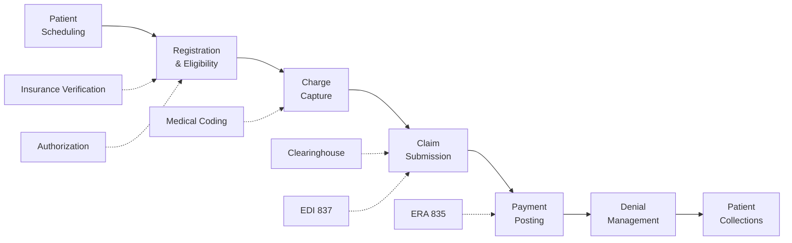

While EHR software focuses on clinical documentation, **Practice Management Software (PMS)** handles the administrative and financial operations of a healthcare practice. PMS allows efficient handling of frontline office administration procedures such as processing payments, scheduling appointments, entering patient demographics, and tracking insurance and billing information.

## PMS vs. EHR: Understanding the Difference

| Aspect | Practice Management (PMS) | EHR (Electronic Health Record) |
|--------|--------------------------|--------------------------------|
| **Primary Function** | Administrative & financial operations | Clinical documentation & care |
| **Patient Demographics** | Yes — full registration | Yes — basic demographics |
| **Appointment Scheduling** | Yes | Often integrated |
| **Insurance Verification** | Yes | Limited |
| **Billing & Claims** | Yes — full revenue cycle | No |
| **Clinical Documentation** | No | Yes |
| **Order Entry (CPOE)** | No | Yes |
| **Clinical Decision Support** | No | Yes |
| **E-Prescribing** | No | Yes |
| **Reporting** | Financial & operational reports | Clinical quality reports |
| **Primary Users** | Front office, billing staff | Clinicians, nurses, MAs |

Many modern platforms offer **integrated EHR/PMS systems** that combine both into a single software solution, eliminating duplicate data entry and improving workflow efficiency.

## Core PMS Modules

### 1. Patient Demographics

The **Patient Demographic** feature compiles all necessary account information of the patient. This is typically organized into three tabs:

```yaml
Patient Tab:
  └─ Name, date of birth, gender
  └─ Address, phone numbers, email
  └─ Social Security Number
  └─ Race, ethnicity, language
  └─ Marital status, occupation, education
  └─ Employer information
  └─ Emergency contact

Guarantor Tab:
  └─ Person financially responsible for the account
  └─ Same as patient (adult) or parent/guardian (minor)
  └─ Guarantor name, address, contact information
  └─ Employer and income information (if needed for financial assistance)
  └─ Relationship to patient

Insurance Tab:
  └─ Primary insurance carrier
  └─ Secondary insurance carrier (if applicable)
  └─ Policy number and group number
  └─ Subscriber name and date of birth
  └─ Claims submission address and phone number
  └─ Copayment amount and deductible
  └─ Insurance effective and termination dates
```

**Additional demographic information collected:**
- Reason for visit and clinical issues
- Pharmacy preference
- Referring provider information
- Advance directive status
- Language preference and interpreter needs

### 2. Insurance and Billing Information

The patient's health insurance card and guarantor information must be accurately recorded:

| Insurance Element | Description | Verification Required |
|------------------|-------------|---------------------|
| **Type of Insurance** | Commercial, Medicare, Medicaid, Self-Pay | At each visit |
| **Insurance Carrier** | Name of insurance company | At registration |
| **Policy Number** | Member ID from insurance card | At each visit |
| **Group Number** | Employer group number | At registration |
| **Claims Address** | Where claims should be submitted | At registration |
| **Copayment Amount** | Patient's cost per visit | At each visit |
| **Deductible Status** | Amount met vs. remaining | At each visit |
| **Coinsurance** | Percentage patient pays after deductible | At registration |

### 3. Appointment Scheduling

Patients may be scheduled in different ways, with the most common being the **fixed schedule** where the patient is asked to appear at a specific date and time.

```yaml
Scheduling Methods:
  └─ Fixed Time: Specific date and time assigned (most common)
  └─ Wave Scheduling: Multiple patients same time, seen in order of arrival
  └─ Group Scheduling: Similar appointments grouped together
  └─ Open Access: Same-day scheduling for urgent needs
  └─ Double Booking: Two patients scheduled for overlapping times

Electronic Scheduling Benefits:
  └─ Faster search for schedule availability
  └─ Easy rescheduling and cancellation
  └─ Quick links to patients' clinical data
  └─ Automated appointment reminders (phone, text, email)
  └− Wait list management
  └─ Provider schedule templates with time blocks
  └─ Color-coded appointment types
  └─ Real-time schedule views across multiple locations

Appointment Statuses:
  └─ Scheduled: Patient has confirmed appointment time
  └─ Checked In: Patient has arrived and registered
  └− In Room: Patient placed in examination room
  └─ Checked Out: Patient completed visit
  └─ No Show: Patient did not arrive
  └− Cancelled: Appointment cancelled by patient or practice
  └− Rescheduled: Appointment moved to different date/time
```

### 4. Accounting Procedures

**Account Ledger:**
An account ledger should be available in the system and should include:

| Ledger Element | Description |
|----------------|-------------|
| **Payor Name** | Guarantor or responsible party |
| **Contact Information** | Address, phone, email |
| **Charges Posted** | All services billed with dates and codes |
| **Payments Made** | Patient payments and insurance reimbursements |
| **Adjustments** | Contractual adjustments, write-offs, discounts |
| **Balance Owed** | Current outstanding balance |
| **Insurance Reimbursement Details** | EOB/ERA information, payment amounts |

**Day Sheet:**
The **day sheet** is another document that contains checks and balances for bank deposits:

```yaml
Day Sheet Contents:
  └─ Date of services
  └─ Patient name and account number
  └─ Charges for the day (total and per provider)
  └─ Payments received (patient and insurance)
  └─ Adjustments posted
  └─ New balance totals
  └− Deposit reconciliation
  └− Transaction log for audit trail

Day Sheet Purpose:
  └─ Verifies all daily transactions balance
  └─ Ensures all payments are deposited
  └─ Provides daily financial summary
  └− Creates audit trail for accounting
  └− Identifies discrepancies before they compound
```

### 5. Claims Management

The PMS handles the complete claim lifecycle:

```yaml
Claim Lifecycle:
  1. Charge Capture:
     └─ Services documented in the encounter are translated to billing codes
     └─ Provider signs off on encounter
     └─ Codes are assigned (CPT, ICD-10, HCPCS, modifiers)
  
  2. Claim Generation:
     └─ CMS-1500 form is generated electronically
     └─ Data is pulled from encounter and patient demographics
     └─ Claim is checked for errors (edits/scrubbing)
  
  3. Claim Submission:
     └─ Electronic submission via clearinghouse
     └─ Direct submission to payer (if supported)
     └─ Paper submission (for payers requiring paper)
  
  4. Payment Posting:
     └─ Insurance payment is received and posted
     └─ Electronic Remittance Advice (ERA) auto-posts
     └─ Patient payments are posted
     └─ Adjustments are applied
  
  5. Denial Management:
     └─ Denied claims are reviewed
     └─ Corrections made and claims resubmitted
     └─ Appeals filed when appropriate

  6. Patient Billing:
     └─ Patient statements generated for remaining balances
     └─ Payment plans arranged as needed
     └─ Collections process initiated for delinquent accounts
```

## Revenue Cycle Management (RCM)

Revenue Cycle Management encompasses the entire financial lifecycle of a patient encounter:



| RCM Step | Average Timeline | Key Metric |
|----------|-----------------|------------|
| Patient Scheduling | Days to weeks in advance | Fill rate: > 85% |
| Registration & Eligibility | Day of service | Eligibility verification: 100% |
| Charge Capture | Day of service | Charge lag: < 2 days |
| Claim Submission | 1-3 days post-service | Clean claim rate: > 95% |
| Payment Posting | 14-45 days post-submission | Days in A/R: < 35 |
| Denial Management | 30-60 days post-submission | Denial rate: < 5% |
| Patient Collections | 30-90 days post-billing | Collection rate: > 90% |

## Key PMS Reports

| Report | Purpose | Frequency |
|--------|---------|-----------|
| **Accounts Receivable (A/R) Aging** | Tracks unpaid claims by age (30/60/90/120+ days) | Weekly |
| **Provider Productivity** | RVUs, encounters, and charges per provider | Monthly |
| **Charge Lag Report** | Days between service date and charge entry | Weekly |
| **Denial Analysis** | Root causes of claim denials | Monthly |
| **Day Sheet** | Daily financial reconciliation | Daily |
| **Patient Ledger** | Individual patient account history | On demand |
| **Appointment Report** | Schedule fill rates, no-show rates, cancellations | Weekly |
| **Collections Report** | Patient balances and collection activity | Monthly |

## Key Takeaways

- Practice Management Software (PMS) handles administrative and financial operations — appointment scheduling, patient demographics, insurance verification, billing, and claims management
- PMS differs from EHR: PMS manages the business side, EHR manages clinical documentation — many platforms integrate both
- Patient demographics are organized into three tabs: Patient (personal info), Guarantor (financial responsibility), Insurance (coverage details)
- Electronic scheduling offers real-time availability, auto-reminders, wait list management, and integration with clinical data
- The account ledger tracks all financial transactions; the day sheet provides daily reconciliation and deposit verification
- The claim lifecycle spans charge capture → claim generation → submission → payment posting → denial management → patient billing
- Revenue Cycle Management (RCM) metrics include clean claim rate, days in A/R, denial rate, and collection rate
- Key PMS reports include A/R aging, provider productivity, charge lag, and denial analysis
