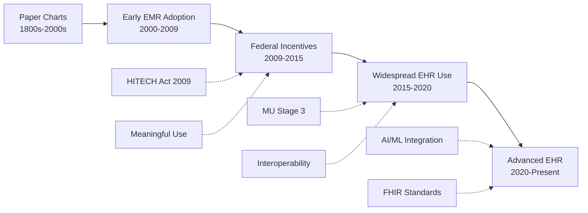
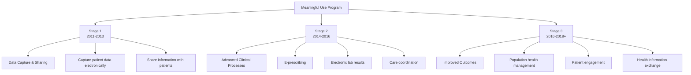

The transition from paper-based documentation to electronic health records represents one of the most significant healthcare infrastructure changes in modern history. This transformation did not happen overnight — it was driven by federal policy, financial incentives, and a growing recognition that paper records were no longer sufficient for modern healthcare delivery.

## The Evolution: From Paper to Electronic



## The Recovery Act of 2009

The **Obama administration** continued to push for the electronic process in the **Recovery Act of 2009** (formally the American Recovery and Reinvestment Act — ARRA). This legislation included the **HITECH Act** (Health Information Technology for Economic and Clinical Health Act), which provided the legal framework and funding for widespread EHR adoption.

### Key Provisions of the HITECH Act

| Provision | Impact |
|-----------|--------|
| **Financial Incentives** | Provided $27 billion in incentives for Medicare and Medicaid providers to adopt and meaningfully use EHR technology |
| **Meaningful Use Program** | Established three stages of EHR use requirements with increasing complexity |
| **Standards and Certification** | Created certification criteria for EHR systems to ensure interoperability |
| **Privacy and Security** | Expanded HIPAA requirements to include business associates and increased penalties for violations |
| **Regional Extension Centers** | Provided technical assistance to providers adopting EHRs |
| **Workforce Development** | Funded health IT training programs to build the workforce needed for EHR adoption |

<Aside variant="info" title="The HITECH Act Investment">
  The HITECH Act authorized approximately $27 billion in incentives over 10 years. Eligible providers could receive up to $44,000 (Medicare) or $63,750 (Medicaid) for demonstrating meaningful use of certified EHR technology. The investment was designed to accelerate what had been a slow, voluntary transition.
</Aside>

## Computerized Provider Order Entry (CPOE)

The **Computerized Provider Order Entry (CPOE)** was developed to enter and send treatment orders or instructions electronically. CPOE allows providers to:

```yaml
CPOE Capabilities:
  └─ Enter medication orders electronically
  └─ Order laboratory tests and diagnostic imaging
  └─ Place referral and consultation orders
  └─ Enter nursing and ancillary service orders
  └─ Send orders directly to the appropriate department

Benefits of CPOE:
  └─ Eliminates illegible handwriting errors
  └─ Reduces transcription errors
  └─ Provides real-time drug interaction checking
  └─ Enforces standardized order sets
  └─ Tracks order status and completion
  └─ Speeds up order processing and execution
  └─ Creates audit trail for all orders

Research Findings:
  └─ CPOE reduces medication errors by 48-81%
  └─ Orders are processed 2-3 times faster than paper
  └─ Serious medication errors decreased by 55% in CPOE-equipped hospitals
  └─ Laboratory orders are completed 25% faster
```

## EHR Adoption Rates: A Timeline

The transition from paper-based documentation to electronic means was initially slow but accelerated significantly with government incentives:

| Year | EHR Adoption Rate | Key Driver |
|------|-------------------|------------|
| **2007-2008** | ~17% | Early adopters, large health systems |
| **2011** | ~34% | Meaningful Use Stage 1 begins, incentive payments start |
| **2013** | ~48% | Stage 1 requirements take full effect |
| **2015** | ~78% | Stage 2 requirements; Medicare penalties begin for non-adopters |
| **2017** | ~86% | Widespread adoption — majority of providers using certified EHR |
| **2020** | ~89% | Stage 3 and Promoting Interoperability |
| **2024** | ~96% | Near-universal adoption in hospitals and physician offices |

```yaml
Adoption Statistics by Setting (2024):
  └─ Hospitals: 96% have adopted certified EHR technology
  └─ Office-Based Physicians: 89% using any EHR system
  └─ Critical Access Hospitals: 97% EHR adoption
  └─ Rural Health Clinics: 82% EHR adoption
  └─ Long-Term Care Facilities: 65% EHR adoption (growing)

Adoption Barriers (Historical):
  └─ Cost of implementation: $15,000-$70,000 per provider
  └─ Loss of productivity during transition: 3-6 months
  └─ Training requirements: 40-80 hours per staff member
  └─ Data migration complexity: Paper records must be scanned or transcribed
  └− Workflow disruption: Existing processes must be redesigned
  └⁻ Interoperability challenges: Different systems do not always communicate
```

## The Meaningful Use Program

The **Meaningful Use (MU) incentive program** was a payment enticement program for physicians or eligible specialists who use and implement EHR technology following given requirements. The program was formed in **2011** and was meant to launch a significant implementation of electronic technology.

### Three Stages of Meaningful Use



#### Stage 1: Data Capture and Sharing (2011-2013)

| Objective | Measure |
|-----------|---------|
| Record patient demographics | 50%+ of patients have demographics recorded electronically |
| Maintain active medication list | 80%+ of patients have at least one medication entry |
| Maintain active allergy list | 80%+ of patients have allergies recorded |
| Record vital signs | 50%+ of patients have vital signs recorded |
| Record smoking status | 50%+ of patients 13+ have smoking status recorded |
| Provide clinical summaries | 50%+ of office visits have clinical summaries provided |
| Electronic prescribing | 40%+ of prescriptions transmitted electronically |
| Protect health information | Conduct or review security risk analysis |

#### Stage 2: Advanced Clinical Processes (2014-2016)

Stage 2 raised the thresholds and added new requirements focused on care coordination and patient engagement:

| Objective | Measure |
|-----------|---------|
| Electronic prescribing | 60%+ of prescriptions transmitted electronically (up from 40%) |
| Structured lab results | 55%+ of lab results are structured electronic data |
| Patient portal access | 50%+ of patients have online access to their health information |
| Secure messaging | 5%+ of patients send secure messages to their provider |
| Health information exchange | 10%+ of care transitions include electronic summary of care |
| Patient-specific education | 10%+ of patients receive patient-specific education resources |
| Medication reconciliation | 50%+ of care transitions include medication reconciliation |

#### Stage 3: Improved Outcomes (2016-2018+)

In 2018, the Meaningful Use program was renamed the **Promoting Interoperability Program**, with Stage 3 objectives focusing on:

```yaml
Stage 3 / Promoting Interoperability Objectives:
  └─ Electronic Prescribing: 60% of prescriptions queried for drug formulary
  └─ Clinical Information Reconciliation: 80% of transitions include reconciliation
  └─ Provider to Patient Exchange: 50%+ of patients access their records electronically
  └─ Public Health Reporting: Immunization registries, syndromic surveillance, and electronic case reporting
  └─ Health Information Exchange: Support transitions of care across unaffiliated organizations
  └− Patient Access to API: Enable patients to access records via smartphone apps (added 2021)

Penalty Structure:
  └─ Providers who failed to demonstrate meaningful use faced Medicare payment adjustments
  └─ Penalties started at 1% of Medicare payments and increased annually
  └─ By 2018, non-adopters faced a 5% reduction in Medicare payments
```

<Aside variant="tip" title="The HITECH Act Investment Paid Off">
  In 2015, all eligible professionals were required to implement the electronic processing measures and objectives. Those who did not faced Medicare payment penalties. The combination of incentives and penalties drove adoption from 17% to over 86% in just 8 years — one of the most successful federal healthcare IT initiatives in history.
</Aside>

## EHR Contributors and Ownership

### Who Contributes to the EHR

Multiple healthcare professionals document in the EHR, each contributing different types of information:

| Professional | Key Contributions |
|-------------|------------------|
| **Physician** | Diagnoses, treatment plans, prescriptions, referral orders |
| **Nurse** | Vital signs, nursing assessments, medication administration, patient education |
| **Medical Assistant** | Patient history, chief complaint, vitals, rooming preparation |
| **Specialist** | Specialty evaluations, procedure notes, consultation reports |
| **Pharmacist** | Medication reconciliation, drug interaction monitoring |
| **Medical Biller** | CPT/ICD-10 coding, charge capture, claim submission |
| **Lab Technician** | Test results, quality metrics |
| **Radiologist** | Imaging interpretations and reports |

### Who Owns the EHR

Medical records are owned by the facility or individuals who created them:

| Setting | Owner | Patient Rights |
|---------|-------|---------------|
| **Hospital** | The hospital/institution | Patient can request copies |
| **Private Practice** | The practice/provider | Patient can request copies |
| **Health System** | The health system | Patient can request copies |
| **Patient Portal** | May be jointly managed | Patient has direct access |

Patients have the legal right to:
- Request access to their medical information through a medical release form
- Request restricted access to specific information
- Ask for a list of disclosures (who has requested their medical information)
- Request amendments to their record
- Receive copies of their records (reasonable fee may apply)

The doctrine of professional discretion allows the provider to use their best judgment in sharing information with patients with unstable conditions, such as those being treated for mental or emotional disturbances.

## Key Takeaways

- The transition from paper to electronic records was driven by the HITECH Act (part of the 2009 Recovery Act), which provided $27 billion in financial incentives for EHR adoption
- Adoption rates grew from 17% (2007) to over 96% (2024) — one of the most successful federal healthcare IT initiatives
- CPOE (Computerized Provider Order Entry) enables electronic entry and transmission of treatment orders, reducing medication errors by 48-81%
- The Meaningful Use program had three stages: data capture (Stage 1), advanced clinical processes (Stage 2), and improved outcomes (Stage 3), later renamed the Promoting Interoperability Program
- Stage 1 focused on capturing data electronically; Stage 2 emphasized care coordination and patient engagement; Stage 3 targeted population health and interoperability
- Non-adopters faced Medicare payment penalties starting at 1% and increasing to 5%
- Healthcare professionals across multiple roles contribute to the EHR — each role documents different aspects of patient care
- Medical records are owned by the facility that created them, but patients have extensive rights to access and control their health information
