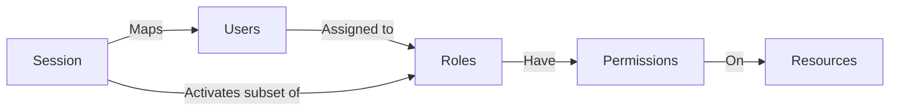
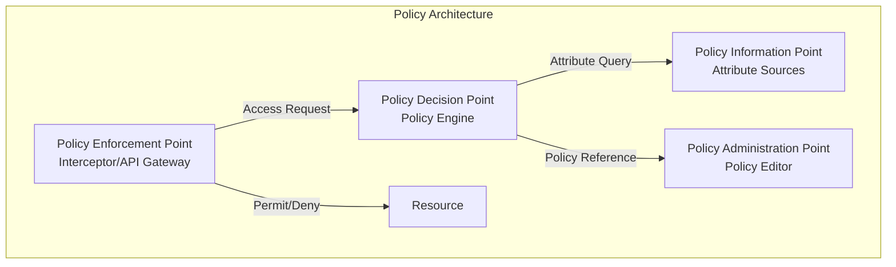

While authentication answers *"Who are you?"*, authorization answers *"What are you allowed to do?"*. Authorization is the process of enforcing access policies — determining whether an authenticated identity has the right to perform a specific action on a specific resource. If authentication is the gate, authorization is the guard inside the gate.

Authorization is fundamentally different from authentication in one critical way: authentication can be binary (yes/no, authenticated or not), but authorization is **contextual and multi-dimensional**. A single user may have different permissions depending on the resource they are accessing, the action they are performing, the time of day, the device they are using, and the network they are connected to.

## Authorization Models Overview

| Model | Name | Decision Basis | Granularity | Complexity | Scalability | Best For |
|-------|------|---------------|-------------|------------|-------------|----------|
| **DAC** | Discretionary Access Control | Resource owner's discretion | Per-object | Low | Low | Simple file sharing, personal data |
| **MAC** | Mandatory Access Control | Security labels (classification) | Label-based | Medium | Medium | Government/military, high-security environments |
| **RBAC** | Role-Based Access Control | User's role(s) | Role-level | Medium | High | Enterprise applications with defined job functions |
| **ABAC** | Attribute-Based Access Control | User, resource, action, and environment attributes | Fine-grained | High | Very High | Dynamic, context-sensitive environments |
| **PBAC/ReBAC** | Policy/Relationship-Based | Central policies or entity relationships | Policy/Graph | High | High | Microservices, collaborative platforms |

### A Note on Hybrid Models

In practice, most organisations use **hybrid authorization models**. For example, RBAC provides coarse-grained access control based on job role, while ABAC rules add fine-grained, context-aware restrictions on top. This is sometimes called "dynamic RBAC" or "RBAC + ABAC" and is the most common pattern in modern IAM deployments.

## Discretionary Access Control (DAC)

In DAC, the **owner** of a resource decides who can access it and with what permissions. Each resource has an access control list (ACL) specifying which users or groups have which permissions.

**Real-world examples:**
- Linux file permissions (`rwxr-xr--`) — the file owner sets permissions for owner, group, and others
- Windows NTFS permissions — each file/folder has an ACL with user/group entries
- Google Drive sharing — document owner shares with specific users or groups
- SharePoint site permissions — site owner grants access to site members

**Advantages:**
- Simple, intuitive — resource owners understand their data best
- Decentralised — no central administrator needed for routine access grants
- Flexible — owners can grant access quickly without bureaucracy

**Disadvantages:**
- **No central policy enforcement** — each owner makes independent access decisions, leading to inconsistent security
- **Does not scale** — every resource requires administrative attention
- **Shadow access** — owners may grant access without proper authorisation
- **Audit nightmare** — hundreds of thousands of individual ACLs to review
- **Owner dependency** — if the owner leaves, resources become orphaned

## Mandatory Access Control (MAC)

In MAC, access decisions are based on **security labels** (classification levels) assigned to every subject (user) and object (resource). Labels form a lattice: a subject can access an object only if the subject's clearance level equals or exceeds the object's classification level. Users **cannot** override or modify these decisions — not even resource owners.

**Real-world examples:**
- Government/military classifications: Top Secret > Secret > Confidential > Unclassified > Public
- SELinux on Linux: every process and file has a security context enforced by the kernel
- Windows Mandatory Integrity Control: integrity levels (System > High > Medium > Low)

**Advantages:**
- **Strong security guarantees** — policy cannot be circumvented by users
- **Central control** — security administrators define the classification scheme
- **Clear data flow rules** — no read-up, no write-down (Bell-LaPadula model)
- **Proven in high-security environments** — used by defence and intelligence agencies

**Disadvantages:**
- **Inflexible** — classification systems are rigid and difficult to adapt to dynamic environments
- **High administration overhead** — every resource must be classified, every user cleared
- **Poor usability** — users cannot share resources freely
- **Difficult to implement at enterprise scale** — few commercial systems support MAC

## Role-Based Access Control (RBAC)

RBAC assigns permissions to **roles**, and roles to users. Rather than managing individual user permissions, administrators define roles that reflect job functions. Users receive permissions by being assigned to roles, and when a user changes roles, their permissions automatically change with the assignment.

### NIST RBAC Model



### NIST RBAC Rules

The NIST RBAC standard defines three core rules:

1. **Role assignment** — A subject can exercise a permission only if the subject has been assigned a role
2. **Role authorization** — A subject's active role must be authorised for the subject (no self-assignment of arbitrary roles)
3. **Permission authorization** — A subject can exercise a permission only if the permission is authorised for the subject's active role

### NIST RBAC Levels

| Level | Name | Description |
|-------|------|-------------|
| **Flat RBAC** | Core | Users have roles; roles have permissions; users have many-to-many relationships with roles |
| **Hierarchical RBAC** | Level 1 | Roles can inherit permissions from other roles (e.g., Senior Engineer inherits Engineer permissions) |
| **Constrained RBAC** | Level 2 | Adds separation of duties (SOD) — mutually exclusive roles cannot be assigned to the same user |
| **Symmetric RBAC** | Level 3 | Reviews and audits role assignments for compliance |

### RBAC Example — Finance System

```
Role: AP Clerk
├── Permission: Enter invoices
├── Permission: View payment history
└── Permission: View vendor records

Role: AP Manager (inherits AP Clerk + additional)
├── Permission: Approve invoices
├── Permission: Release payments
└── Permission: Run payment reports

Role: Finance Director (inherits AP Manager + additional)
├── Permission: Manage GL codes
├── Permission: Approve write-offs
└── Permission: Override payment holds

Role: Auditor (no inheritance — separate hierarchy)
├── Permission: Read all transactions
├── Permission: Run audit reports
└── Permission: View approval history
```

<Aside variant="tip">
RBAC is the most widely deployed authorization model in enterprise IAM because it balances administrative efficiency with security control. A user joining the Finance team simply gets the "Finance User" role — all permissions are pre-configured in the role definition.
</Aside>

### RBAC Challenges

| Challenge | Description | Mitigation |
|-----------|-------------|------------|
| **Role explosion** | Too many roles created (thousands) — defeats the purpose | Role mining, role lifecycle management, periodic role certification |
| **Role granularity** | Roles are either too coarse (excessive access) or too fine (too many roles) | Tiered role structure: base roles, functional roles, entitlement roles |
| **Role drift** | Permissions added to roles over time without review | Periodic role certification, entitlement reviews |
| **Static nature** | RBAC does not handle context (time, location, risk) well | Layer ABAC policies on top of RBAC foundation |

## Attribute-Based Access Control (ABAC)

ABAC evaluates access decisions based on **attributes** of the user, resource, action, and environment. Policies are expressed as boolean rules that combine multiple attributes.

### The ABAC Attribute Categories

| Category | Examples | Source |
|----------|----------|--------|
| **Subject (user) attributes** | Department, role, clearance level, location, manager, employment type | HR system, IdP, identity directory |
| **Resource attributes** | Classification, owner, department, region, data type | Resource metadata, data classification tool |
| **Action attributes** | Read, write, delete, approve, export, admin | Application context, API method |
| **Environment attributes** | Time of day, network location, device posture, risk score | Network, device management, risk engine |

### ABAC Policy Example — Full

```json
{
  "policyId": "POL-001",
  "policyName": "Access Salary Records",
  "effect": "Permit",
  "target": {
    "resource": "Salary Records",
    "action": "Read | View | Export"
  },
  "conditions": {
    "allOf": [
      { "user.department": { "equals": "resource.department" } },
      { "user.role": { "in": ["HR_Manager", "Payroll", "Finance_Director"] } },
      { "environment.time": { "between": ["09:00", "17:00"] } },
      { "environment.network": { "in": ["corporate_vpn", "office_wifi", "office_lan"] } },
      { "user.mfa_enabled": { "equals": true } },
      { "user.clearance": { "gte": "resource.min_clearance" } }
    ]
  }
}
```

### ABAC vs RBAC — Decision Framework

| Aspect | RBAC | ABAC |
|--------|------|------|
| **Policy definition** | Static roles with pre-assigned permissions | Dynamic rules based on attributes |
| **Granularity** | Coarse to medium (role-level) | Fine-grained (individual transaction level) |
| **Policy change impact** | May require role redesign (ripple effect) | Single policy rule update (isolated impact) |
| **Attribute requirements** | Role membership only | Multiple attribute sources needed |
| **Deployment complexity** | Low to medium | Medium to high |
| **Performance** | Fast (pre-computed role memberships) | May require real-time attribute resolution |
| **Auditability** | Simple (who has which role?) | Complex (which attributes resulted in allow/deny?) |
| **Best for** | Stable job functions, consistent access patterns | Dynamic, context-sensitive, fine-grained access needs |

### Combining RBAC and ABAC

The most practical approach: **RBAC for coarse-grained access, ABAC for fine-grained control**.

```
1. RBAC check: Does user have the "HR Manager" role?
   ├── No → Deny
   └── Yes → Proceed to ABAC check

2. ABAC check: Does the context meet policy requirements?
   ├── User.department = Resource.department? → Yes
   ├── Time between 09:00-17:00? → Yes
   ├── Network = corporate? → Yes
   └── MFA enabled? → Yes → Allow
```

## Policy-Based Access Control (PBAC)

PBAC externalises access decisions from applications to a dedicated **Policy Decision Point (PDP)** that evaluates centrally managed policies. This separates the "what" (policy) from the "how" (application logic).

### PBAC Architecture (XACML / OAuth UMA)



### PBAC Implementations

| Technology | Description | Best For |
|------------|-------------|----------|
| **XACML 3.0** | eXtensible Access Control Markup Language — OASIS standard for ABAC/PBAC | Enterprise, cross-platform, formal policy management |
| **OPA (Open Policy Agent)** | Open-source policy engine with declarative Rego language | Cloud-native, Kubernetes, microservices |
| **AWS Cedar** | Open-source policy language from AWS | AWS applications, fine-grained permissions |
| **Auth0 / Okta** | Cloud-based policy management with visual policy builder | SaaS applications, customer-facing apps |

## Relationship-Based Access Control (ReBAC)

ReBAC models access as **relationships between entities** in a graph. Instead of defining policies in terms of user attributes or roles, ReBAC defines them as paths through a relationship graph. It is best for applications where access naturally follows relationships — for example, Google Docs (owner → editor → commenter → viewer), Slack channels, or SharePoint sites.

### How ReBAC Works

In ReBAC, the question is not "does user X have role Y?" but "does user X have a relationship OF TYPE Z to resource W?"

```
User: Alice
Relationship to Document D: "owner"
→ Alice can delete Document D

User: Bob
Relationship to Document D: "editor" (via Alice's grant)
→ Bob can edit Document D

User: Carol
Relationship to Document D: "viewer" (via Bob's grant)
→ Carol can view Document D

User: Dave
No relationship to Document D
→ Dave has no access to Document D
```

### Google Zanzibar — The ReBAC Reference Architecture

Google Zanzibar is Google's global authorization system, used by Google Drive, YouTube, Gmail, and Google Cloud. Key characteristics:

- **Graph-based** — relationships are edges in a directed graph (user → relation → object)
- **Consistent** — uses Google Spanner for globally consistent reads and writes
- **Real-time** — authorization checks complete in under 10ms at Google scale
- **Objective-based** — instead of asking "what can Alice access?", Zanzibar answers "can Alice READ Document D?"

**Open-source Zanzibar implementations:**
- **OpenFGA** — OpenFGA (by Auth0/Okta) is the most popular open-source Zanzibar implementation
- **Auth0 FGA** — Auth0's managed Fine-Grained Authorization service
- **Permit.io** — General-purpose policy engine with ReBAC support

## Choosing the Right Authorization Model

There is no single "best" authorization model. The right approach depends on:

| Factor | RBAC is Better | ABAC is Better | ReBAC is Better |
|--------|---------------|---------------|-----------------|
| **Organisation size** | 100–10,000 users | 10,000+ users, global | Any size with collaborative data |
| **Access pattern** | Stable job functions | Dynamic, project-based | Team/organisation-based sharing |
| **Data model** | Centralised applications | Microservices, APIs | Collaborative content platforms |
| **Regulatory needs** | Basic SOD, access certification | Complex SOD, GDPR, HIPAA | Shared data access governance |
| **Change frequency** | Low (stable org structure) | High (frequent reorgs) | Medium (team changes) |

## Key Takeaways

- Authorization determines what an authenticated user is permitted to do — it is inherently contextual and multi-dimensional
- RBAC is the industry standard: assign permissions to roles, roles to users. It scales well but is static by nature
- ABAC adds fine-grained, context-aware policy evaluation using subject, resource, action, and environment attributes
- The most practical approach combines RBAC (coarse-grained role assignment) with ABAC (fine-grained context rules)
- PBAC externalises authorization decisions to a dedicated policy engine (XACML, OPA, Cedar), separating policy from application logic
- ReBAC models access as relationships in a graph (Google Zanzibar pattern) — ideal for collaborative platforms where access follows organisational structures
- Choose the authorization model based on organisational scale, access patterns, data model, regulatory requirements, and rate of change
