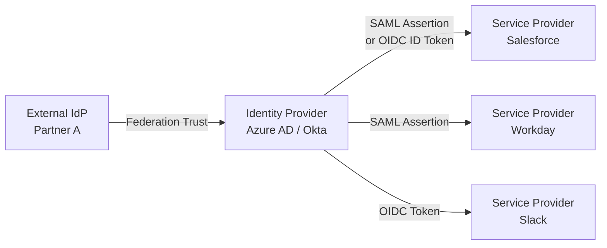

A **digital identity** is a collection of attributes that represents a person, service, or device within a digital system. It is the electronic representation of an entity — the set of claims about that entity that a system trusts. Every interaction in the digital world begins with an identity, making it the most fundamental building block of IAM.

Understanding digital identity is critical because every IAM control — authentication, authorization, provisioning, governance — depends on having a reliable representation of who or what is requesting access. If the identity is untrustworthy, everything built on top of it is compromised.

## Types of Digital Identities

Not all identities are human. Modern IAM systems manage multiple identity types, each with distinct characteristics, lifecycle patterns, and security requirements:

| Identity Type | Example | Credential Type | Lifecycle | Risk Profile |
|---------------|---------|-----------------|-----------|--------------|
| **User identity** | Employee, contractor, customer | Password, FIDO2, biometrics | JML (joiner-mover-leaver) | Moderate — human error, phishing |
| **Service identity** | API client, microservice | Client secret, certificate, token | Long-lived, manual rotation | High — often over-privileged, rarely rotated |
| **Device identity** | Laptop, server, IoT sensor | Certificate, TPM, device token | Hardware lifecycle | Moderate — theft, compromise |
| **Workload identity** | Kubernetes pod, cloud function | Short-lived token, OIDC federation | Ephemeral, auto-provisioned | Low — limited scope, auto-rotated |

<Aside variant="caution">
Service and workload identities now outnumber human identities in most large enterprises — yet they are frequently unmanaged, over-privileged, and invisible to governance processes. Machine identity management is one of the fastest-growing IAM disciplines.
</Aside>

### Human Identities — Deeper Dive

Human identities break down further by relationship type:

- **Employees** — Full lifecycle managed by HR-to-IAM integration. Strong identity proofing (IAL2+). Governed by employment contract.
- **Contractors / Temporary workers** — Time-bound identities with automatic expiry. Often managed through a separate vendor portal. Higher risk of orphan accounts if expiry is not enforced.
- **Partners / Vendors** — Federated identities from partner IdPs. Trust is delegated to the partner's identity proofing process. Access is limited to specific shared resources.
- **Customers** — CIAM (Customer IAM) identities. Self-registered, lower assurance (IAL1 typically). High scale, high churn, privacy-sensitive.

### Non-Human Identities — The Growing Challenge

Non-human identities (NHIs) include service accounts, API keys, OAuth apps, and machine certificates. Key challenges:

- **Discovery** — Most organisations don't have a complete inventory of service accounts
- **Credential rotation** — Service account passwords and secrets are rarely rotated, creating standing privileges
- **Ownership** — Orphaned service accounts persist long after the application or team that created them is gone
- **Monitoring** — NHI activity is often excluded from analytics, hiding anomalous behaviour

## Identity Attributes — The Building Blocks of Policy

Every digital identity is composed of attributes that describe it. These attributes feed directly into authorization policies, access decisions, and governance processes:

| Attribute Category | Examples | Used For |
|--------------------|----------|----------|
| **Identifiers** | Username, employee ID, email, UUID, UPN | Uniquely identifying the identity across systems |
| **Demographic** | Name, department, location, job title, cost centre | ABAC policies, organisational reporting |
| **Role** | Job function, manager, clearance level, union membership | RBAC role assignment, access certification routing |
| **Account** | Creation date, last login, password age, MFA status, locked status | Account hygiene monitoring, risk scoring |
| **Entitlement** | Assigned roles, group memberships, direct permissions, application access | Access certification, SOD analysis |

<Aside variant="tip">
The quality of your IAM system depends on the quality and accuracy of your identity attributes. Garbage in, garbage out. Attribute governance — ensuring attributes are authoritative, current, and accurate — is a prerequisite for advanced IAM capabilities like ABAC and dynamic risk scoring.
</Aside>

### Attribute Sources and Authority

Identity attributes typically come from multiple sources:

```
HR System (Workday) — authoritative for: name, department, manager, cost centre, status
Active Directory        — authoritative for: account name, group membership, password policy
Manager                 — authoritative for: role assignment, project membership
Application Owner       — authoritative for: application-specific entitlements
Self-service            — authoritative for: personal contact preferences, profile photo
```

Conflicts between attribute sources must be resolved through a defined **attribute authority matrix** that specifies which system is authoritative for each attribute.

## Identity Proofing

Before a digital identity can be trusted, the real-world entity behind it must be verified. **Identity proofing** is the process of collecting and verifying evidence about an identity to establish a defined level of confidence that the identity is genuine.

### Why Identity Proofing Matters

Without proofing, an attacker can create a digital identity claiming to be anyone. High-profile breaches often begin with weak identity proofing — for example, attackers posing as contractors or using stolen personal information to register fraudulent accounts.

### NIST 800-63 Identity Assurance Levels (IAL)

The NIST SP 800-63-4 framework defines three levels of identity proofing rigour:

<Steps>
### IAL1 — Self-Attested (No Proofing)
No evidence collection or verification required. The user provides attributes (name, email, organisation) without verification. The identity has low trust value.

**Suitable for:** Public-facing content, newsletter signups, demo environments, low-risk SaaS trials.

**Risks:** Impersonation is trivial. No reliable audit trail. Not acceptable for regulated access.

### IAL2 — Remote or In-Person Proofing (Standard)
Requires verification of supplied identity evidence. The applicant must provide a government-issued ID or other approved evidence, which is checked for authenticity and validity. The applicant must also prove they are the owner of the evidence (e.g., through live facial comparison).

**Common methods:**
- Uploading a photo of a government ID (passport, driver's licence) — validated through document forensic checks
- Knowledge-based verification (KBV) — answering questions derived from credit history (increasingly deprecated due to data breaches)
- Live video interview with an identity agent
- In-person verification at a trusted registration desk

**Suitable for:** Employee onboarding, contractor access, financial services, healthcare access.

### IAL3 — In-Person Physical Proofing (High Assurance)
Requires face-to-face verification by an authorised agent. The identity evidence is physically examined, and biometric comparison (fingerprint or facial) is performed in person. The binding between the identity and credential (e.g., PIV card, FIDO2 key) occurs in the same supervised session.

**Suitable for:** Privileged access administrators, national security positions, payment system operators, roles requiring PIV/CAC credentials.
</Steps>

### Identity Proofing Workflow — Detailed

A production identity proofing flow follows this process:

1. **Resolution** — Collect the applicant's claimed identity attributes (name, DOB, address) through a registration form or HR data import
2. **Validation** — Verify the identity evidence is genuine, unexpired, and unaltered. For documents, this involves checking security features (holograms, microprint, UV patterns) through automated or manual inspection
3. **Verification** — Confirm the applicant is the rightful owner of the identity evidence. For remote proofing, this typically involves liveness detection and facial comparison between the applicant's live image and the photo on the ID
4. **Binding** — Bind the verified identity to a credential (e.g., smart card, FIDO2 device, mobile authenticator). The binding must be cryptographically or procedurally linked to the proofing event
5. **Issuance** — Deliver the credential to the applicant through a secure channel. Re-verify identity at point of delivery for high-assurance credentials

### Proofing at Scale

Enterprise organisations face significant challenges in identity proofing at scale:

| Challenge | Solution |
|-----------|----------|
| **Global workforce** — different document types across 100+ countries | Automated document verification supporting 3000+ document types |
| **Remote onboarding** — no physical HR presence | Remote identity proofing with liveness detection and video interview |
| **Privacy regulations** — GDPR limits biometric data collection | Privacy-preserving verification using liveness scores instead of stored biometrics |
| **False positives** — legitimate identities flagged as fraudulent | Machine learning models with continuous tuning and manual appeal process |

## Identity Federation

Federation enables an identity created in one domain to be trusted in another. This is the foundation of **Single Sign-On (SSO)** across organisational boundaries and is a cornerstone of modern IAM architectures.

### How Federation Works

In a federated model, one organisation (the **Identity Provider** or IdP) asserts identity claims about a user. Another organisation (the **Service Provider** or SP) trusts those claims and grants access accordingly.



### Federation Protocols

| Protocol | Token Format | Best For |
|----------|-------------|----------|
| **SAML 2.0** | XML (SAML Assertion) | Enterprise web applications, government systems |
| **OpenID Connect (OIDC)** | JSON (ID Token + Access Token) | Modern web apps, mobile, APIs, single-page apps |
| **WS-Federation** | XML | Legacy Microsoft-centric environments |

### Federation Trust Models

- **Hub-and-spoke** — Central IdP authenticates users and federates to multiple SPs. Common in enterprises using Azure AD or Okta
- **Cross-federation** — Multiple organisations establish pairwise trust. Used in partner/supplier ecosystems
- **Brokered federation** — A third-party broker manages trust relationships between multiple IdPs and SPs. Used in government networks (e.g., SAFE-BioPharma)

## Key Takeaways

- Digital identities represent users, services, devices, and workloads — each with distinct characteristics and security requirements
- Non-human identities (service accounts, API keys, certificates) now outnumber human identities and require dedicated management processes
- Identity attributes are the building blocks of IAM policy decisions — attribute quality determines IAM quality
- Identity proofing establishes trust in a digital identity through evidence verification. NIST IAL1–IAL3 provide a maturity framework for proofing rigour
- The proofing workflow follows: resolution → validation → verification → binding → issuance
- Federation extends identity trust across organisational and system boundaries using SAML 2.0, OIDC, or WS-Federation
