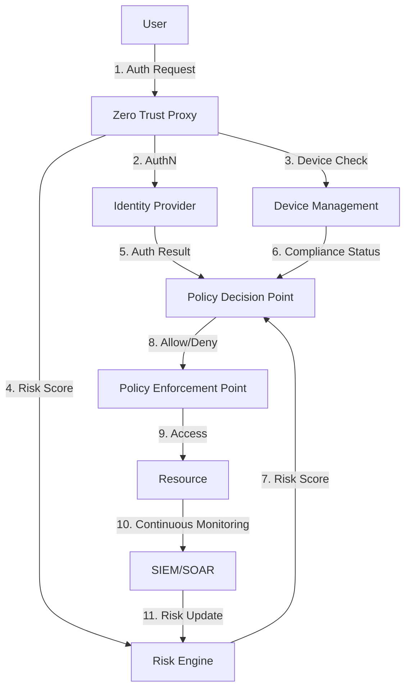

IAM architecture defines how identity services are structured, deployed, and integrated across an organisation. The right architecture depends on organisational scale, cloud adoption, regulatory requirements, acquisition history, and existing technology investments. Getting the architecture wrong can result in security gaps, operational inefficiency, and costly re-platforming.

Architecture decisions have long-lasting consequences. Unlike an application or a tool, IAM architecture defines the **identity fabric** that connects every system, user, and access policy in the organisation. Changing it later requires migrating every connected system, re-federation, and re-provisioning — a multi-year effort.

## Architectural Patterns

### Centralized IAM

A single IAM platform serves as the hub for all identity and access management functions. All users, applications, and policies are managed from one control plane.

```
                ┌─────────────────┐
                │   IAM Platform  │
                │ (Okta/Azure AD) │
                └────────┬────────┘
                         │
         ┌───────────────┼───────────────┐
         │               │               │
    ┌────┴────┐    ┌────┴────┐    ┌──────┴──────┐
    │   App   │    │   App   │    │    App      │
    │   A     │    │   B     │    │    C        │
    └─────────┘    └─────────┘    └─────────────┘
```

**Pros:**
- **Single source of truth** for identity — no confusion about which system holds authoritative data
- **Consistent policy enforcement** — one policy engine, one set of rules, one audit trail
- **Simplified audit and reporting** — one platform to query for all access data
- **Lower operational overhead** — one team manages one platform
- **Faster time-to-value** — one integration pattern for all applications

**Cons:**
- **Single point of failure** — if the IAM platform goes down, all authentication and authorization is affected
- **May not support legacy applications** — legacy apps with embedded identity stores resist centralisation
- **Scaling challenges** — a single platform must handle peak authentication load across the entire organisation
- **Acquisition integration** — acquired companies with different IAM platforms must be migrated or federated

**Best for:** Small to medium organisations (< 10,000 users), cloud-native companies, organisations with one primary directory (AD or cloud IdP).

### Decentralized (Federated) IAM

Each business unit, subsidiary, or geography manages its own identity infrastructure, with federation for cross-domain access. This is common in large enterprises with diverse business units or after significant acquisition activity.

```
    ┌──────────────┐      ┌──────────────┐
    │  BU A IdP    │◄────►│  BU B IdP    │
    │  (Okta)      │      │  (Azure AD)  │
    └──────┬───────┘      └──────┬───────┘
           │                     │
    ┌──────┴──────┐       ┌──────┴──────┐
    │  BU A Apps  │       │  BU B Apps  │
    └─────────────┘       └─────────────┘
```

**Pros:**
- **Business unit autonomy** — each BU controls its own identity policies and integrations
- **No single point of failure** — one BU's IdP outage does not affect others
- **Acquisition integration** — acquired companies keep their existing IAM; integration is via federation
- **Regional compliance** — data residency and sovereignty requirements can be satisfied per-region

**Cons:**
- **Inconsistent policy enforcement** — each BU may have different security standards
- **Complex audit** — auditors must collect data from multiple platforms
- **Higher operational overhead** — multiple IAM teams, multiple platforms to manage
- **Attribute fragmentation** — user attributes inconsistent across BUs (department names, role definitions)
- **User experience fragmentation** — users in one BU cannot seamlessly access another BU's applications

**Best for:** Large enterprises with autonomous business units, organisations with multiple major acquisitions, global organisations with strict data residency requirements.

### Hybrid IAM — The Most Common Pattern

Combines on-premises directories with cloud identity platforms, synchronising identity data between them. This is the dominant architecture in the market as most enterprises are in some stage of cloud migration.

```
    ┌────────────────────┐     ┌────────────────────┐
    │  On-Premises AD    │◄───►│  Cloud IdP         │
    │  (authoritative)   │     │  (Azure AD / Okta) │
    └────────┬───────────┘     └─────────┬──────────┘
             │                           │
    ┌────────┴────────┐        ┌─────────┴─────────┐
    │  On-Prem Apps   │        │  Cloud / SaaS Apps│
    │  (SAP, File     │        │  (Salesforce,     │
    │   Servers, VPN) │        │   Slack, Workday) │
    └─────────────────┘        └───────────────────┘
```

**Sync Infrastructure:**

| Tool | Source | Target | Use Case |
|------|--------|--------|----------|
| **Azure AD Connect** | On-prem AD | Azure AD | User, group, password hash sync; pass-through auth; federation |
| **Okta LDAP Agent** | On-prem AD | Okta Universal Directory | User and group sync; attribute mapping; password sync |
| **Microsoft Identity Manager** | Multiple sources | Multiple targets | Complex HR-to-AD-to-cloud provisioning scenarios |
| **Custom SCIM bridge** | On-prem IDM | Cloud IdP | Automated provisioning using SCIM standard |

**Pros:**
- **Preserves investment** in on-premises Active Directory and legacy IAM infrastructure
- **Enables gradual cloud migration** — move applications to cloud authentication at your own pace
- **Works with legacy applications** — legacy apps that require AD/LDAP continue to function
- **Provides bridge** between on-premises and cloud identity worlds

**Cons:**
- **Increased complexity** — synchronisation introduces latency, conflict resolution, and monitoring challenges
- **Sync latency** — changes in AD take 2-30 minutes to propagate to the cloud IdP (depending on sync interval)
- **Attribute conflicts** — when attributes differ between on-prem and cloud, resolution rules are needed
- **Troubleshooting difficulty** — identity issues could originate in AD, the sync engine, or the cloud IdP
- **Multiple credential stores** — password changes must synchronise; password writeback may be needed

<Aside variant="tip">
Hybrid IAM is the most common architecture in enterprise environments undergoing cloud migration. The key to success is well-defined authoritative source mappings and a clearly documented attribute authority matrix.
</Aside>

## Cloud-Native IAM

Organisations built on cloud infrastructure from the ground up — or those that have completed their cloud migration — can adopt cloud-native IAM architectures that have no on-premises dependency:

| IAM Component | Cloud-Native Approach | Examples |
|---------------|----------------------|----------|
| **Identity store** | Cloud IdP only — no on-premises directory | Azure AD, Okta, Auth0, Google Cloud Identity |
| **Authentication** | OIDC, OAuth 2.0, WebAuthn — no Kerberos/NTLM | Standard protocols, no legacy dependencies |
| **Authorization** | Cloud-native policy engine — centralised PDP | OPA (Open Policy Agent), AWS Cedar, Auth0 FGA |
| **Provisioning** | SCIM and API-based — no connectors for LDAP/AD | Direct SCIM to SaaS apps, HR-to-IdP integration |
| **Directory** | Cloud LDAP as a service if needed | JumpCloud, PingDirectory cloud, Azure AD Domain Services |
| **Governance** | SaaS IGA platform | SailPoint IdentityNow, Saviynt, Okta Governance |
| **Device identity** | MDM/UEM integration | Microsoft Intune, Jamf, VMware Workspace ONE |

**Cloud-Native IAM Challenges:**

| Challenge | Mitigation |
|-----------|------------|
| **Internet dependency** — cloud IdP outage blocks all authentication | Offline auth capabilities (cached credentials for managed devices), failover IdP |
| **Application compatibility** — legacy apps require LDAP/Kerberos | Cloud LDAP bridge (Azure AD DS, JumpCloud), application modernisation roadmap |
| **Network segmentation** — apps need to authenticate without internet | Local IdP cache, hybrid until all apps support modern auth |
| **Vendor lock-in** — deeply integrated with one cloud IdP | Standard protocol usage (OIDC, SCIM) enables future migration |

## Zero Trust Architecture and IAM

IAM is central to Zero Trust — the security model that assumes no user, device, or network is inherently trustworthy. Zero Trust is not a product but a set of architectural principles that fundamentally change how authentication and authorization are designed.

### Zero Trust Principles for IAM

1. **Verify explicitly** — Authenticate and authorize every access request based on all available data points, not just at the network perimeter. Every request — from any location, on any device — is treated as potentially hostile.

2. **Least privilege** — Grant only the minimum access required for the user to perform their task. Use just-in-time (JIT) and just-enough-access (JEA) policies to grant privileged access only when needed and for a limited duration.

3. **Assume breach** — Segment access by design, monitor continuously, and never implicitly trust any user, device, or network. Design IAM systems assuming that credentials can be compromised and that network perimeters are porous.

### IAM Components in a Zero Trust Architecture



### Zero Trust IAM Technology Stack

| Layer | Technology | Purpose |
|-------|------------|---------|
| **Identity Provider** | Azure AD, Okta, Auth0 | Authentication, MFA, session management |
| **Device Trust** | Intune, Jamf, Workspace ONE | Device compliance, certificate-based device identity |
| **Policy Engine** | OPA, Azure AD Conditional Access, Okta Identity Engine | Policy evaluation, risk-based access decisions |
| **Proxy/Gateway** | Cloudflare Access, Zscaler, Pomerium, Tailscale | Zero Trust proxy — no direct network access |
| **Privileged Access** | CyberArk, BeyondTrust, Delinea | JIT/JEA for privileged accounts, session isolation |
| **Monitoring** | SIEM, SOAR, UEBA | Continuous verification, anomaly detection |

## Cloud Provider IAM Reference Architectures

### AWS IAM
- **Identity source**: AWS IAM (users, groups, roles) or external IdP (via IAM Identity Center)
- **Authentication**: IAM users, federated identity (SAML/OIDC), IAM roles for EC2/Lambda
- **Authorization**: IAM policies (JSON-based, managed or inline), SCPs for account guardrails, resource-based policies
- **Best for**: AWS-native workloads, organisations using AWS Control Tower

### Azure IAM (Microsoft Entra)
- **Identity source**: Entra ID (formerly Azure AD), on-prem AD synced via Entra Connect
- **Authentication**: OIDC, SAML, password hash sync, pass-through auth, federation with AD FS
- **Authorization**: Azure RBAC (management plane), Entra ID roles (identity plane), Conditional Access policies
- **Best for**: Microsoft-centric organisations, hybrid Windows environments

### Google Cloud IAM
- **Identity source**: Google Cloud Identity, external IdP federation
- **Authentication**: OAuth 2.0, OIDC, gcloud CLI, workload identity federation
- **Authorization**: IAM roles (predefined/custom), policy bindings, Organization/Folder/Project hierarchy
- **Best for**: Google Workspace organisations, data analytics, Kubernetes-native (GKE)

## Choosing an Architecture — Decision Matrix

| Factor | Favour Centralized | Favour Decentralized | Favour Hybrid | Favour Cloud-Native |
|--------|-------------------|---------------------|---------------|---------------------|
| **Organisation size** | Small–Medium (< 10K) | Large enterprise (10K+) | Enterprise with legacy | Any (but requires modern apps) |
| **Cloud maturity** | Cloud-first | Multi-cloud/multi-region | Migration in progress | Fully cloud-native |
| **Regulatory** | Single jurisdiction | Multiple jurisdictions | Mixed on-prem/cloud | Standard international |
| **Acquisition history** | Organic growth | Multiple acquisitions | Some acquisitions | Recent or no acquisitions |
| **Legacy systems** | Few | Few | Many | None |
| **Team capability** | Centralised IAM team | BU-level IAM teams | Central + infrastructure | DevOps/Platform team |
| **Compliance rigor** | Standard | Varies by BU | Standard + legacy | Standard + automated |

## Key Takeaways

- Centralized IAM provides consistency and simplicity but creates a single point of failure; decentralized provides autonomy at the cost of consistency
- Hybrid IAM is the most common enterprise pattern, bridging on-premises AD and cloud IdP through synchronisation tools (Azure AD Connect, Okta LDAP Agent)
- Cloud-native IAM uses OIDC, OAuth 2.0, WebAuthn, cloud directories, and SaaS IGA — no on-premises dependency — but requires all applications to support modern authentication protocols
- Zero Trust IAM verifies every request explicitly using all available signals (identity, device, location, behaviour risk) — it is the dominant security architecture for modern IAM design
- Cloud providers offer distinct IAM reference architectures (AWS IAM, Microsoft Entra, Google Cloud IAM) with different identity sources, authentication protocols, and authorization models
- Architecture choice depends on organisational scale, cloud maturity, regulatory requirements, acquisition history, legacy system footprint, team structure, and compliance requirements
