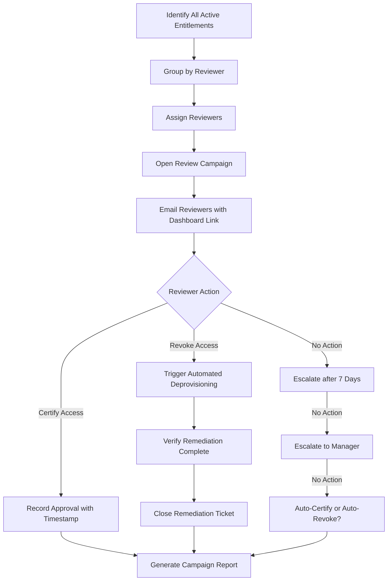

IAM governance is the framework of policies, processes, and controls that ensure identity and access management operates effectively, transparently, and in compliance with regulatory requirements. Governance answers the question: *"How do we know our IAM controls are working?"*

While identity management and access management are the *doing* parts of IAM — creating identities, provisioning accounts, authenticating users — governance is the *checking* part. It verifies that the doing is correct, complete, and compliant. Without governance, IAM becomes chaotic: orphan accounts accumulate, privileges creep, access reviews become rubber-stamping exercises, and audit findings pile up.

## Why IAM Governance Matters

The consequences of poor IAM governance are severe and well-documented:

- **Insider threats** — Former employees with active accounts (the 2024 Data Breach Investigations Report found that insider threats account for over 30% of breaches, many involving orphaned accounts)
- **Regulatory penalties** — GDPR fines of up to €20M or 4% of annual revenue; HIPAA penalties of up to $50K per violation
- **Audit failures** — SOX Section 404 requires management to assess internal controls over financial reporting; IAM failures are the most common material weakness
- **Fraud** — Absence of segregation of duties enables financial fraud (the average occupational fraud case lasts 12 months before detection — ACFE Report)

<Aside variant="caution">
Regulators do not accept "we trust our administrators" as a control. Governance provides provable, auditable evidence that access controls are working. Every access grant, every permission change, every review decision must be recorded, attributable, and reviewable.
</Aside>

## Core Governance Processes

### Access Certification (Access Reviews)

Access certification is the periodic review of user entitlements by resource owners and managers. It is the single most important governance process — the mechanism by which organisations confirm that current access is appropriate.

**The Certification Lifecycle:**



**Certification Best Practices:**

| Practice | Rationale | Implementation |
|----------|-----------|----------------|
| **Risk-based frequency** | High-risk access reviewed more often | Admin access: quarterly; Standard access: annually; Low-risk: biennially |
| **Automated reminders** | Prevent campaign bottlenecks | Day 0: invitation; Day 7: reminder; Day 14: escalation to manager; Day 21: escalation to compliance |
| **Closed-loop remediation** | Ensure revoked access is actually removed | Automated verification 24h after revocation; re-check at campaign close |
| **Separation of duties** | Reviewer independence | Reviewer must be different from the person who granted the access |
| **Evidence preservation** | Audit readiness | Store all certification records for minimum 3 years (or per regulatory requirement) |
| **Peer review** | Catch rubber-stamping | Reviewers must provide justification for certify decisions on high-risk access |
| **Manager attestation** | Accountability | Direct managers certify their direct reports' access; application owners certify application-level access |

**Types of Certification Campaigns:**

| Campaign Type | Scope | Reviewer | Frequency |
|---------------|-------|----------|-----------|
| **User-to-Access** | Every user's entitlements across all applications | User's manager | Annually |
| **Access-to-User** | Every application's user list | Application owner | Quarterly (critical apps), annually (standard) |
| **Role certification** | Role definitions and memberships | Role owner | Annually |
| **Privileged access** | Admin/root/break-glass accounts | Security team + manager | Quarterly |
| **SoD conflict review** | Users with conflicting access | Compliance team | Quarterly |
| **Orphan account review** | Accounts without active owners | Application owners | Monthly |

### Segregation of Duties (SoD)

Segregation of duties ensures that no single person has enough access to commit fraud or cause significant damage. Conflicting access combinations must be identified, prevented where possible, and mitigated where unavoidable.

**Common SoD Conflict Pairs:**

| Role A | Role B | Risk | Industry |
|--------|--------|------|----------|
| Purchase Requisition Creator | Purchase Order Approver | Create and approve own purchases | Finance, Procurement |
| Accounts Payable Clerk | Vendor Administrator | Create fake vendor and pay invoices to self | Finance |
| Network Administrator | Security Auditor | Modify audit logs to hide unauthorised activity | IT, Security |
| Code Developer | Code Promoter (Production) | Push un-reviewed code to production | Software Engineering |
| HR Data Entry | Payroll Administrator | Add fake employee and process payroll | HR, Finance |
| Cash Application Clerk | Customer Credit Administrator | Apply payments to own account and extend credit | Finance |
| System Administrator | Access Recertification Approver | Certify own excessive access | IT, Security |

**SoD Implementation Approaches:**

1. **Preventive controls** — System blocks conflicting access assignments in real time. The IAM platform checks each new entitlement request against the SoD matrix and rejects assignments that create conflicts. Strongest control — prevents the problem.

2. **Detective controls** — System identifies and reports existing conflicts during periodic certification. Weaker than preventive but catches inherited conflicts (e.g., from mergers) or conflicts that arise from role changes.

3. **Mitigating controls** — Compensating controls for unavoidable conflicts. When a conflict cannot be avoided (e.g., in a small organisation where one person must perform multiple roles), compensating controls include:
   - Enhanced monitoring and logging of all transactions
   - Mandatory peer review of high-risk actions
   - Transaction thresholds requiring second approval
   - Post-transaction random audits

**SoD Rule Authoring Example:**

```json
{
  "sodRuleId": "SOD-FIN-001",
  "description": "User must not have both AP Clerk AND Vendor Admin access",
  "conflictingRoles": ["AP_Clerk", "Vendor_Admin"],
  "severity": "Critical",
  "controlType": "Preventive",
  "mitigation": {
    "allowed": false,
    "overrideRequired": true,
    "overrideApprover": "Compliance Officer"
  }
}
```

### Audit and Reporting

IAM systems must produce auditable records that satisfy internal and external audit requirements. Audit readiness is a continuous state, not an annual exercise.

| Audit Requirement | IAM Evidence | Retention Period |
|-------------------|-------------|------------------|
| **Who has access to what?** | Entitlement reports, role membership lists, application access matrices | Current + 3 years |
| **Who granted the access?** | Approval workflow audit trails with approver identity and timestamp | 3-7 years (varies by regulation) |
| **When was access last reviewed?** | Access certification campaign records, reviewer decisions, timestamps | 3-7 years |
| **When was access removed?** | Deprovisioning logs with action, timestamp, and operator | 3-7 years |
| **Were there unauthorised changes?** | Change logs, SIEM integration, anomaly detection alerts | 1 year (hot), 7 years (cold) |
| **Are SoD rules enforced?** | SoD violation reports, override requests, approval records | 3-7 years |
| **Are privileged actions monitored?** | PAM session recordings, command logs, credential check-in/check-out records | 1-3 years |

## Compliance Frameworks — Detailed Requirements

| Framework | Scope | Key IAM Requirements | Penalties for Non-Compliance |
|-----------|-------|---------------------|------------------------------|
| **SOX (Sarbanes-Oxley)** | Financial reporting controls for US publicly traded companies | Access controls over financial systems, audit trails, SoD for financial roles, management attestation (Section 404) | Fines up to $5M, executive imprisonment up to 20 years |
| **GDPR** | Personal data of EU citizens | Right to erasure (Article 17), data access controls, identity verification for data subjects, breach notification (Article 33) | €20M or 4% of global annual revenue |
| **HIPAA** | Protected health information (PHI) in US healthcare | Access controls (45 CFR §164.312), unique user identification, automatic logoff, audit controls, integrity controls | $50K-$1.5M per violation category per year |
| **PCI DSS v4.0** | Payment card data | Requirement 7: Need-to-know access; Requirement 8: Unique IDs, MFA for admin access; Requirement 10: Audit trails; Requirement 12: Access reviews | $5K-$100K per month by card brands, potential loss of processing ability |
| **ISO 27001:2022** | Information security management | A.5.15 Access control policy, A.5.18 Access rights, A.8.2 Privileged access rights, A.8.3 Information access restriction, A.8.16 Monitoring activities | Certification revocation, business partner trust erosion |
| **NIST SP 800-53 r5** | US federal information systems | AC-1 Access control policy, AC-2 Account management, AC-3 Access enforcement, AC-6 Least privilege, AU Audit and accountability | Loss of authorisation to operate (ATO), contract termination |

## IGA Technology — Identity Governance and Administration Tools

As organisations mature their governance programs, they invest in dedicated IGA tools:

| IGA Platform | Key Capabilities | Best For |
|-------------|------------------|----------|
| **SailPoint IdentityNow/IdentityIQ** | Access certification, SoD, role mining, lifecycle management, identity analytics | Large enterprises, complex governance requirements |
| **Saviynt** | Access governance, SoD, cloud security, application access, data access governance | Cloud-first, multi-SaaS environments |
| **Omada Identity** | Access certification, role-based provisioning, self-service | Regulated industries (finance, pharma) |
| **Microsoft Entra ID Governance** | Access reviews, entitlement management, PIM, identity governance | Microsoft-centric organisations |
| **Okta Identity Governance** | Access certification, SoD, lifecycle management, workflows | Okta-centric IAM environments |

## IAM Maturity Model — Detailed

Governance maturity typically progresses through these stages. Understanding your organisation's current level is the first step toward improvement:

| Level | Name | Characteristics | Key Metrics | Typical Org |
|-------|------|----------------|-------------|-------------|
| **1** | Initial | Ad-hoc, no formal processes, no access reviews, manual provisioning, no SoD enforcement | No metrics tracked | Startup, < 100 employees |
| **2** | Defined | Documented policies exist, periodic manual access reviews (spreadsheet-based), basic SoD rules, some automation | Access review completion rate: 60-80% | Small-medium business, 100-1000 employees |
| **3** | Managed | Automated access certification, SoD detection enforced, role-based provisioning, HR integration active | Review completion: > 95%, SoD violations identified, auto-deprovisioning SLA: < 24h | Mid-market, 1000-5000 employees |
| **4** | Measured | Continuous monitoring, real-time SoD enforcement, risk-based review cycles, automated remediation, KPIs tracked | Deprovisioning SLA: < 1h, provisioning accuracy: > 99%, orphan accounts: < 1% | Enterprise, 5000+ employees |
| **5** | Optimized | Predictive analytics, AI-driven anomaly detection, automated role mining, identity fabric, continuous adaptive trust | Proactive risk reduction, zero-day orphan detection, automated policy generation | Large enterprise, 10,000+ employees |

<Aside variant="tip">
Most enterprises operate at Level 2 or 3. Moving from Level 3 to Level 4 requires investment in IGA tools, process automation, and organisational commitment to continuous compliance. Level 5 is aspirational for most organisations.
</Aside>

## Key Takeaways

- IAM governance provides auditable, provable evidence that access controls are working — it is the "checking" that ensures IAM operations are correct and compliant
- Access certification must be risk-based (different frequencies for different risk levels), automated (reminders, escalation, verification), and closed-loop (revoke → verify → report)
- Segregation of duties prevents fraud by identifying and blocking conflicting access combinations — implement preventive controls where possible, detective where necessary, and compensating where unavoidable
- Multiple compliance frameworks (SOX, GDPR, HIPAA, PCI DSS, ISO 27001, NIST SP 800-53) mandate IAM controls with significant penalties for non-compliance
- IAM maturity progresses through five levels (Initial → Defined → Managed → Measured → Optimized) — most organisations are at Level 2 or 3
- Moving to higher maturity levels requires investment in IGA technology, process automation, and organisational commitment to continuous compliance verification
