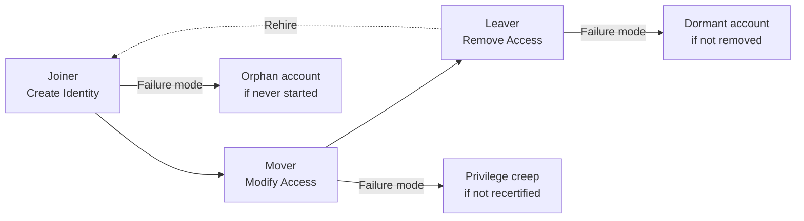

Every digital identity follows a predictable lifecycle from creation to removal. The **joiner-mover-leaver (JML)** model is the industry-standard framework for managing identity lifecycles in enterprise IAM. Mastering JML is essential for any IAM professional because it governs how identities flow through the organisation — and the security risks at each stage.

The JML model is deceptively simple in concept but complex in execution. Large enterprises process thousands of JML events per month across hundreds of connected systems, each with its own identity store, provisioning method, and deprovisioning capability.

## The JML Model

### Joiner — Onboarding

When a person joins an organisation, IAM systems must create a digital identity and provision the necessary access. The joiner process is the most visible IAM function and directly impacts employee productivity.

**Step-by-step joiner workflow:**

1. **Trigger** — HR system (Workday, SAP SuccessFactors, BambooHR) creates employee record with a start date. An identity event is published to the IAM platform
2. **Identity creation** — IAM creates identity records in authoritative directories:
   - Active Directory user object with UPN, department, location attributes
   - Cloud IdP (Azure AD / Okta) user with group assignments
   - Email mailbox (Exchange Online / Google Workspace)
3. **Entitlement assignment** — Based on the user's role, department, and location, IAM assigns a baseline set of entitlements:
   - **Universal access** — Email, VPN, intranet, corporate SSO
   - **Role-based access** — Applications required for the user's job function
   - **Discretionary access** — Additional applications requested by the manager
4. **Account provisioning** — IAM pushes account creation to target systems via:
   - SCIM (modern): REST API calls to create user accounts
   - PowerShell / LDAP (legacy): Direct directory manipulation
   - Custom connectors: JDBC-based adapters for legacy applications
5. **Credential issuance** — Initial credentials are delivered to the user:
   - Temporary password (must change on first login)
   - Hardware token (FIDO2 key, smart card) for privileged roles
   - Mobile authenticator registration for MFA
6. **Notification** — Stakeholders are informed:
   - Manager: Welcome email with access summary
   - IT: Checklist for hardware and network access
   - Security: Record of identity creation for audit
   - Facilities: Badge access if applicable

<Aside variant="caution">
A common failure point: new hires are given excessive access "temporarily" that is never reviewed. Always start with least privilege. It is far easier to add access later than to remove excessive access after it has become embedded in the user's workflow.
</Aside>

### Mover — Role Changes

When a user changes roles, departments, or employment status, their access must evolve. The mover scenario accounts for the majority of identity changes in a typical enterprise — far more people change roles than join or leave.

**Mover scenarios in detail:**

| Scenario | Actions Required | Risk |
|----------|-----------------|------|
| **Department transfer** | Remove old department entitlements, add new department entitlements, update directory attributes | User retains access to old department data (data leakage) |
| **Promotion** | Add elevated permissions, potentially activate privileged access management (PAM) controls | Accumulation of old and new privileges (privilege creep) |
| **Demotion / Reorganisation** | Remove or reduce permissions, reassign reporting structure | Over-privileged user in lower-authority role |
| **Location change** | Update compliance attributes, geographic access policies, legal entity | Non-compliance with regional data residency laws |
| **Contractor-to-employee conversion** | Transition identity type, update HR attributes, re-apply appropriate policy | Policy gaps during transition window |
| **Name change** | Update display name, email alias, UPN across all systems | Inconsistent identity data, missed communications |

**The Mover Challenge:** Unlike joiner (which creates from scratch), mover requires precise changes to existing entitlements. The key challenge is ensuring that old access is removed while new access is added — removing only what should be removed and adding only what should be added.

<Aside variant="tip">
The mover scenario is where **role-based access control (RBAC)** excels. A well-designed RBAC model means that changing a user's role assignment automatically recalculates their entitlements — old role permissions are removed, new role permissions are added, with no manual intervention.
</Aside>

### Leaver — Offboarding

When a user leaves the organisation, their digital identities must be deprovisioned promptly and completely. Leaver processing is the single most important IAM control for security — delayed or incomplete deprovisioning is responsible for countless insider threat incidents.

**Deprovisioning actions by urgency:**

| Priority | Action | Description | Method |
|----------|--------|-------------|--------|
| **Tier 1 — Immediate (seconds)** | Account disable | Suspension of AD/IdP account prevents all authentication | Disable user object, revoke all sessions |
| **Tier 1 — Immediate** | Credential revocation | Reset password, invalidate all tokens and sessions | Force password reset, revoke refresh tokens, terminate SSO sessions |
| **Tier 1 — Immediate** | MFA reset | Remove MFA registrations to prevent OTP generation | Clear MFA device registrations |
| **Tier 1 — Immediate** | VPN / Remote access | Revoke VPN certificates, disable remote access accounts | Certificate revocation, RADIUS disable |
| **Tier 2 — 1 hour** | Application access | Remove group memberships, role assignments across all apps | SCIM PATCH to remove group membership, role de-assignment |
| **Tier 2 — 1 hour** | Privileged access | Remove PAM entitlements, check in all vaulted credentials | PAM session termination, credential check-in |
| **Tier 3 — 24 hours** | Data handover | Transfer OneDrive, email, CRM records to manager | Automated content migration |
| **Tier 3 — 24 hours** | Mailbox forwarding | Set autoreply, delegate mailbox access | Exchange management |
| **Tier 4 — 30-90 days** | Account archival | Move to disabled OU, preserve for legal hold | Directory move, legal hold tag |
| **Tier 4 — 90+ days** | Account deletion | Permanent removal after retention period | Hard delete or anonymisation |

<Aside variant="danger">
Delayed deprovisioning is one of the most common findings in security audits — and one of the most dangerous. The Verizon DBIR consistently finds that insider threats often leverage accounts of former employees. Automated offboarding workflows with defined SLAs are not optional.
</Aside>

## Lifecycle Automation — The Mature Approach

Mature IAM programs automate the JML lifecycle end-to-end:

<Steps>
### HR System Integration — The Source of Truth
Connect IAM to the HRIS (Workday, SAP SuccessFactors, BambooHR) as the authoritative source for identity events. The HRIS publishes identity events (hire, rehire, transfer, termination, name change) via:
- **SCIM** — Modern REST-based event feed
- **SFTP** — Batch file processing (legacy) — typically hourly/daily
- **API** — Real-time event subscription (webhook)
- **JDBC** — Direct database integration

When HR marks someone as terminated, IAM must trigger deprovisioning immediately — no manual steps, no delays, no exceptions.

### Rule-Based Provisioning — The Policy Engine
Use attribute-based rules to determine which accounts and entitlements are needed for each identity. Rules evaluate attributes from the HR feed and other authoritative sources:

- "All employees in Engineering with location = US get GitHub Enterprise access"
- "All employees with job code = 'Sales Rep' get Salesforce CRM access"
- "All employees with cost centre = 'FIN' get SAP Finance access"
- "Contractors with end date within 7 days receive renewal reminder notification"

### Approval Workflows — The Governance Layer
Route non-standard access requests through manager and resource-owner approval gates:

- **Standard access** — Auto-approved based on role (no human intervention)
- **Elevated access** — Requires manager approval + resource owner approval
- **Privileged access** — Requires manager approval + security team approval + PAM enrollment
- **Emergency access** — Self-approved with post-event justification and audit notification

Configure escalation: if a request is not actioned within 48 hours, escalate to the approver's manager, then to compliance.

### Periodic Reconciliation — The Verification Loop
Run entitlement reviews comparing actual access (as provisioned in target systems) to approved access (as defined in IAM policies). Reconciliation identifies:

- **Orphan accounts** — Accounts in target systems whose source identity no longer exists
- **Over-provisioned accounts** — Accounts with more access than the user's current role warrants
- **Uncertified accounts** — Accounts that have not been reviewed in the current certification cycle
- **Dormant accounts** — Active accounts with no recent login activity (90+ days)

Reconciliation reports should be delivered to application owners with automated remediation workflows for common discrepancies.
</Steps>

## Lifecycle Challenges — Real-World Scenarios

Common challenges organisations face — and how to address them:

| Challenge | Root Cause | Mitigation |
|-----------|------------|------------|
| **Orphan accounts** | HR termination not propagated, manual deprovisioning missed | Automated HR-to-IAM integration, quarterly reconciliation sweeps |
| **Dormant accounts** | No inactivity detection, no automatic disable policy | 90-day inactivity detection with automatic disable + notification |
| **Privilege creep** | Access accumulates across role changes without removal | Role-based access with automatic recalculation on role change |
| **Delayed deprovisioning** | Manual offboarding, no SLA enforcement | Automated offboarding workflows with SLAs, dashboard visibility |
| **Contractor over-access** | Contractors retain access after engagement ends | Time-bound accounts with automatic expiry, vendor-managed lifecycle |
| **Application access gaps** | New applications not connected to IAM | Application onboarding governance — no app goes live without IAM integration |

## Key Takeaways

- The joiner-mover-leaver (JML) model governs identity lifecycle management and is the operational foundation of IAM
- Joiner processes must start with least privilege — excessive initial access that is never reviewed is the most common failure
- Mover scenarios (role changes, transfers, promotions) require automatic recalculation of entitlements — never let permissions accumulate
- Leaver deprovisioning must be immediate for Tier 1 actions (account disable, credential revocation) and automated for all tiers
- HR system integration (HRIS → IAM) is the non-negotiable foundation of lifecycle automation
- Periodic reconciliation between actual and approved access catches what automation misses — run it quarterly at minimum
- Service and workload identities follow their own lifecycle patterns and require dedicated management processes
