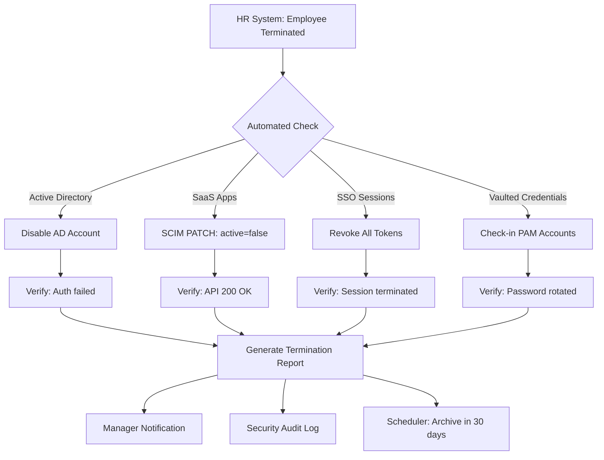

User provisioning is the process of creating, updating, and deleting user accounts and entitlements across target systems. It is the operational heart of IAM — the mechanism that turns identity policy into reality. Without provisioning, identity management is theoretical: users have identities in the directory but no access to the applications they need to do their jobs.

Provisioning is also where IAM meets IT operations directly. Every account created, every group membership added, every permission granted — these are the tangible outputs of the IAM program. Getting provisioning right requires understanding identity models, target system capabilities, API integration patterns, and governance requirements.

## The Provisioning Challenge

Large enterprises manage hundreds of applications, each with its own user store, authentication model, and provisioning interface. Without automated provisioning, IT administrators must manually create accounts in every system — an error-prone, time-consuming, and insecure approach.

<Aside variant="caution">
Manual provisioning is the leading cause of orphan accounts, over-privileged users, and delayed deprovisioning. Automation is not optional. The 2024 Cost of a Data Breach report found that organisations with fully deployed IAM automation saved an average of $1.5M per breach compared to those without.
</Aside>

### The Scale of the Problem

Consider a typical enterprise with 10,000 employees and 200 applications:

- **20,000+ identity changes per quarter** — hires, terminations, transfers, role changes
- **200 app integrations** — each with a different provisioning method (SCIM, API, SFTP, manual)
- **45 minutes per manual provision** — average IT admin time to create, configure, and verify a single account
- **$2M+ annual cost** — just for manual provisioning labour at enterprise scale

## Provisioning Models

### Just-in-Time (JIT) Provisioning

JIT provisioning creates accounts **on first successful authentication**. The user does not exist in the target system until they attempt to access it. When the identity provider (IdP) receives the authentication request, it checks whether the user exists in the target system. If not, it creates the account in real-time using SCIM or the application's API, then completes the authentication flow.

**How JIT works (SAML):**
1. User accesses application URL
2. Application redirects to IdP with SAML AuthnRequest
3. IdP authenticates the user and checks if a matching account exists in the application
4. If no account exists, IdP provisions the account via SCIM or JIT attribute mapping
5. IdP issues SAML assertion with user attributes
6. Application creates local session based on assertion attributes

**Advantages:**
- **Zero pre-provisioning overhead** — no need to create accounts before they are needed
- **License optimisation** — only consumes application licenses for users who actually access the application
- **Reduced attack surface** — fewer dormant accounts sitting unused in target systems
- **Simplified lifecycle** — no need to track which applications a user should be provisioned to; provision on demand

**Disadvantages:**
- **First-access latency** — the first login attempt is slower (account creation adds 1-5 seconds)
- **Application must support JIT** — requires SAML JIT, SCIM, or API-based user creation
- **Limited pre-configuration** — some applications require pre-configured attributes or group memberships that cannot be set at first login
- **Deprovisioning complexity** — accounts exist in the target system only after first access, making deprovisioning dependent on the IdP session revocation

<Aside variant="tip">
JIT is ideal for SaaS applications where user counts affect licensing costs and where access is infrequent or unpredictable. It pairs well with deprovisioning policies that disable access if no login occurs within a defined period.
</Aside>

### Synchronisation-Based Provisioning

Accounts are created in target systems based on changes detected in the authoritative source (usually the HR system). The IAM platform polls or receives events from the HR system, determines the required changes, and pushes account updates to each connected target system.

```
HR System ──> IAM Platform ──> Target Apps
   │              │                │
   │  New hire    │  Create user   │  Account provisioned
   │  Terminate   │  Disable user  │  Access revoked
   │  Transfer    │  Update roles  │  Entitlements modified
   │  Name change │  Update attrs  │  Attributes synchronised
```

**Advantages:**
- **Predictable provisioning** — accounts exist before the user needs them (zero first-login latency)
- **Complex attribute transformations** — supports mapping, merging, and transforming HR data for each target system
- **Works with legacy applications** — supports applications that do not support JIT or SCIM via custom connectors
- **Offline synchronisation** — handles scenarios where target applications are temporarily unavailable (queues and retries)

**Disadvantages:**
- **License consumption** — consumes licenses for all provisioned users regardless of actual application usage
- **Configuration complexity** — each target connector requires separate mapping, transformation, and testing
- **Sync latency** — changes take minutes to hours to propagate (depending on sync schedule)
- **Error cascading** — a failure in the source system or connector can cause provisioning errors across many accounts

### Hybrid Approach: JIT + Sync

Many organisations combine both models:
- **Sync for core systems** — AD, email, ERP, VPN — provisioned before the user's start date
- **JIT for SaaS applications** — Salesforce, Slack, GitHub — provisioned on first access to optimise licensing

## SCIM — The Provisioning Standard

**System for Cross-domain Identity Management (SCIM)** is the open standard for automating identity provisioning. Defined in RFC 7642–7644, SCIM provides a RESTful API for creating, updating, and deleting users and groups. SCIM is supported by all major cloud identity providers and SaaS applications.

### SCIM 2.0 Core Operations

| Operation | HTTP Method | Endpoint | Payload | Response |
|-----------|-------------|----------|---------|----------|
| **Create** | POST | `/Users` or `/Groups` | SCIM resource JSON | 201 + resource with ID |
| **Read** | GET | `/Users/{id}` or `/Groups/{id}` | — | 200 + full resource |
| **Update (Partial)** | PATCH | `/Users/{id}` | Patch operations JSON | 200 + updated resource |
| **Update (Full)** | PUT | `/Users/{id}` | Full SCIM resource JSON | 200 + updated resource |
| **Delete** | DELETE | `/Users/{id}` | — | 204 No Content |
| **Search** | GET | `/Users?filter=userName eq "jdoe"` | Filter parameter | 200 + list of resources |
| **Bulk** | POST | `/Bulk` | Multiple operations JSON | 200 + individual responses |

### SCIM 2.0 Schema Example — Full User Resource

```json
{
  "schemas": ["urn:ietf:params:scim:schemas:core:2.0:User",
              "urn:ietf:params:scim:schemas:extension:enterprise:2.0:User"],
  "id": "2819c223-7f76-453a-919d-413861904646",
  "externalId": "EMP-00421",
  "userName": "jdoe",
  "name": {
    "formatted": "John Doe",
    "givenName": "John",
    "familyName": "Doe",
    "middleName": "A"
  },
  "displayName": "John Doe",
  "emails": [
    {
      "value": "jdoe@acmecorp.com",
      "type": "work",
      "primary": true
    },
    {
      "value": "john.doe@gmail.com",
      "type": "home"
    }
  ],
  "phoneNumbers": [
    {
      "value": "+1-555-0123",
      "type": "work"
    }
  ],
  "active": true,
  "groups": [
    {
      "value": "e9e30dba-f08f-4109-8486-d5c6a331660a",
      "$ref": "/Groups/e9e30dba-f08f-4109-8486-d5c6a331660a",
      "display": "Engineering"
    }
  ],
  "roles": [
    {
      "value": "Engineer",
      "display": "Software Engineer"
    }
  ],
  "meta": {
    "resourceType": "User",
    "created": "2024-01-15T08:00:00Z",
    "lastModified": "2024-06-01T14:30:00Z",
    "version": "W/fANsK6MxIyf0==",
    "location": "https://scim.example.com/Users/2819c223-7f76-453a-919d-413861904646"
  },
  "urn:ietf:params:scim:schemas:extension:enterprise:2.0:User": {
    "employeeNumber": "00421",
    "costCenter": "4130",
    "organization": "Acme Corp",
    "division": "Technology",
    "department": "Information Security",
    "manager": {
      "value": "2819c223-7f76-453a-919d-413861904647",
      "$ref": "/Users/2819c223-7f76-453a-919d-413861904647",
      "displayName": "Jane Smith"
    }
  }
}
```

### SCIM Groups

SCIM also defines a standard `/Groups` endpoint for managing group memberships:

```json
{
  "schemas": ["urn:ietf:params:scim:schemas:core:2.0:Group"],
  "id": "e9e30dba-f08f-4109-8486-d5c6a331660a",
  "displayName": "Engineering",
  "members": [
    {
      "value": "2819c223-7f76-453a-919d-413861904646",
      "$ref": "/Users/2819c223-7f76-453a-919d-413861904646"
    }
  ]
}
```

### Connector Architecture

IAM platforms use **connectors** to translate between the platform's internal identity model and each target system's provisioning interface:

```
IAM Platform
    │
    ├── SCIM Connector → SaaS apps (Salesforce, Slack, Zoom)
    ├── PowerShell Connector → Active Directory, Exchange, SharePoint
    ├── JDBC Connector → Legacy databases (SAP, Oracle EBS)
    ├── REST API Connector → Custom applications with APIs
    ├── LDAP Connector → LDAP-based directories
    └── File Connector → CSV/SFTP batch provisioning (legacy)
```

Each connector handles:
- **Schema mapping** — translating between IAM identity attributes and target system fields
- **Operation mapping** — mapping IAM events (create user, update group) to target system operations
- **Error handling** — retry logic, error reporting, and rollback for failed operations
- **Reconciliation** — periodic comparison of IAM state vs target system state

## Deprovisioning — The Critical Control

Deprovisioning is the process of removing access when it is no longer needed. It is arguably **more important** than provisioning from a security perspective. A missed provision means a user can't do their job — an immediate, visible problem that gets fixed. A missed deprovision means a former employee retains system access — an invisible, latent threat that may not be discovered until a breach occurs.

### Deprovisioning Actions by Timeline

| Priority | Action | Timing | Method | Verification |
|----------|--------|--------|--------|-------------|
| **Tier 1** | Disable AD/IdP account | < 1 minute | Disable user object, revoke sessions | Verify auth attempt rejected |
| **Tier 1** | Revoke all SSO sessions | < 1 minute | Log out all sessions, revoke refresh tokens | Verify SSO portal inaccessible |
| **Tier 1** | Reset password | < 1 minute | Force password reset in IdP | Verify old password rejected |
| **Tier 1** | Revoke MFA devices | < 5 minutes | Clear device registrations | Verify MFA prompt not received |
| **Tier 2** | Remove group memberships | < 1 hour | Remove from AD/IdP groups | Verify group membership |
| **Tier 2** | Disable SCIM accounts | < 1 hour | Set `active: false` via SCIM PATCH | Verify API response |
| **Tier 2** | Revoke privileged access | < 1 hour | Check-in vaulted credentials, terminate PAM sessions | Verify PAM session list |
| **Tier 3** | Transfer data ownership | < 24 hours | Migrate OneDrive/email/CRM records | Verify manager can access |
| **Tier 3** | Set email forwarding | < 24 hours | Auto-reply + delegate mailbox | Verify autoreply working |
| **Tier 4** | Archive account | 30 days | Move to disabled OU | Verify in archive OU |
| **Tier 4** | Delete account | 90 days | Hard delete or anonymise | Verify account not found |

### Deprovisioning Workflow — Mermaid



### Deprovisioning Edge Cases

| Scenario | Challenge | Solution |
|----------|-----------|----------|
| **Employee resignation with notice** | When to deprovision? | Immediate disable + gradual access removal over notice period |
| **Abrupt termination (security-sensitive)** | Need for immediate total cut-off | Kill switch — disable all access instantly, including badge, VPN, email |
| **Extended leave (medical, parental)** | Account suspension vs disable | Suspend (disable re-enable) with data accessible to delegate |
| **Contractor end date** | Automatic expiry enforcement | Set account expiration date at creation; system auto-disables on expiry |
| **Rehire within retention period** | Restore previous account | Link new identity record to old account data |
| **Mergers and acquisitions** | Deprovisioning acquired company accounts | Planned migration with coexistence period |
| **Orphaned service accounts** | No owner to approve deprovision | Automated discovery with multi-owner verification before removal |

## Provisioning Governance

Effective provisioning requires governance controls:

| Control | Description | Frequency |
|---------|-------------|-----------|
| **Reconciliation** | Compare IAM state vs actual state in target systems | Daily (critical systems), weekly (standard), monthly (all) |
| **Error reporting** | Failed provisioning operations flagged for review | Real-time |
| **SLA monitoring** | Time-to-provision and time-to-deprovision metrics | Monthly SLA reports |
| **Entitlement review** | Certify that provisioned access matches approved access | Quarterly (standard), monthly (privileged) |
| **Connector health** | Monitor connector status, error rates, and retry queues | Continuous with alerting |

## Key Takeaways

- User provisioning automates account creation, modification, and removal across target systems — it is the operational heart of IAM
- JIT provisioning creates accounts on demand (optimises licensing, reduces dormant accounts); synchronisation-based provisioning follows HR events (predictable, pre-provisioned)
- SCIM 2.0 (RFC 7642–7644) is the open RESTful standard for provisioning — supported by all major cloud IdPs and SaaS applications
- SCIM defines Users and Groups endpoints with Create, Read, Update (PATCH/PUT), Delete, and Search operations
- Deprovisioning is more critical than provisioning from a security perspective — Tier 1 actions (account disable, credential revocation) must be immediate
- Provisioning governance requires reconciliation, error handling, SLA monitoring, and entitlement reviews
- A structured deprovisioning workflow separates immediate security actions from retention-based cleanup with defined SLAs for each tier
