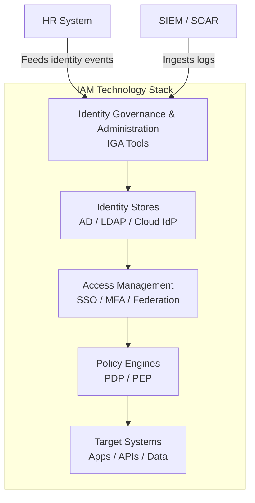

Identity and Access Management (IAM) is the security discipline that enables the **right individuals** to access the **right resources** at the **right time** for the **right reasons**. IAM is a foundational pillar of cybersecurity, governing how digital identities are created, managed, and ultimately removed across an organisation's technology ecosystem.

Without IAM, organisations cannot control who has access to their systems, data, or applications — making them vulnerable to breaches, compliance failures, and operational chaos. As the attack surface expands with cloud adoption, remote work, and third-party integrations, IAM has evolved from a back-office IT function into a strategic board-level concern.

## The Scope of IAM

IAM encompasses every digital interaction where identity matters:

- **Employees** authenticating to corporate applications and VPNs
- **Contractors** accessing client environments under time-bound agreements
- **Customers** registering for and logging into digital services
- **Applications** authenticating to APIs and databases via service accounts
- **Devices** proving their identity to network access controllers
- **Workloads** obtaining tokens to access cloud resources

<Aside variant="caution">
Without IAM, organisations cannot answer two fundamental security questions: *Who is accessing our systems?* and *Should they be?*
</Aside>

## Why IAM Matters — Business Drivers

The business drivers for IAM span security, compliance, and operational efficiency:

| Driver | Impact | Real-World Consequence |
|--------|--------|----------------------|
| **Security** | Reduces breach risk by enforcing least-privilege access and preventing credential misuse | The 2024 Verizon DBIR shows 68% of breaches involve a non-malicious human element — often credential misuse or privilege abuse |
| **Compliance** | Satisfies regulatory mandates (SOX, GDPR, HIPAA, PCI DSS, ISO 27001) requiring access controls and audit trails | Non-compliance can result in fines of up to 4% of global revenue (GDPR) or $50M+ (HIPAA) |
| **Operational Efficiency** | Automates user provisioning, reduces IT helpdesk load, and accelerates onboarding | Enterprises average 45 minutes per manual account creation; at scale this costs millions annually |
| **User Experience** | Enables SSO and self-service password management, reducing friction for end users | Passwords remain the #1 IT helpdesk ticket category — self-service resets cut volume by 30-50% |
| **Audit Readiness** | Provides provable access controls and identity audit trails for internal and external auditors | Audit findings around access control are the most common remediation item in SOX and SOC 2 reports |

## Core Functions of IAM

An IAM program encompasses several interrelated capabilities that work together:

### Identity Management — The Foundation

Identity management is the discipline of creating, storing, and maintaining digital identities throughout their lifecycle.

- **Identity creation** — Establishing digital identities for users, services, and devices based on authoritative data sources (typically HR systems for employees)
- **Identity storage** — Maintaining authoritative identity data in directories such as Active Directory, LDAP, or cloud identity stores
- **Identity federation** — Linking identities across organisational boundaries so that a single identity can access resources in multiple domains
- **Identity analytics** — Analysing identity data to detect anomalies, unused accounts, and privilege creep

### Access Management — The Enforcement Layer

Access management controls how identities interact with resources in real time.

- **Authentication** — Verifying that users are who they claim to be. This ranges from simple password checks to multi-factor authentication (MFA), biometrics, and passwordless methods
- **Authorization** — Determining what authenticated users are permitted to do. This includes role-based access control (RBAC), attribute-based policies (ABAC), and relationship-based models (ReBAC)
- **Policy enforcement** — Applying access rules consistently across all resources, whether on-premises, in the cloud, or in hybrid environments
- **Session management** — Controlling the duration, scope, and risk level of authenticated sessions, including single sign-on (SSO) and step-up authentication

### Governance — The Accountability Layer

Governance ensures that IAM operations are transparent, auditable, and compliant.

- **Access certification** — Regular reviews of who has access to what, conducted by managers and resource owners
- **Segregation of duties (SOD)** — Preventing conflict-of-interest access combinations that could enable fraud
- **Audit and reporting** — Maintaining comprehensive records of identity changes, access grants, and authentication events for compliance and investigation
- **Role management** — Designing, maintaining, and certifying role definitions that align with business functions

## The IAM Technology Stack

A typical enterprise IAM stack includes multiple technology layers:

## IAM in the Enterprise — A Day in the Life

Consider a typical enterprise scenario:

<Steps>
### 8:00 AM — New Hire Joins
HR system (Workday) updates employee record. IGA platform detects the change, creates AD account, assigns base roles (Email, VPN, Intranet), sends provisioning requests to downstream systems (Salesforce, Slack, Jira). Manager receives notification to assign additional application access.

### 10:30 AM — Access Request
New hire needs access to the financial reporting system. They submit a request through the self-service portal. Workflow routes approval to the finance system owner. Upon approval, SCIM provisioning creates the account in the target system within 90 seconds.

### 2:00 PM — MFA Challenge
User attempts to access a privileged admin portal. Since the resource is classified as high-risk, the policy engine triggers step-up authentication — requiring a FIDO2 hardware key in addition to the primary password.

### 5:30 PM — Termination Triggered
HR marks an employee as terminated. IGA immediately disables all accounts, revokes active SSO sessions, triggers a SCIM DELETE to SaaS applications, and initiates the data handover process to the manager.
</Steps>

<Aside variant="tip">
IAM is not a single product — it is a **capability** delivered through people, processes, and technology working together. The best IAM tooling cannot compensate for poorly designed processes or untrained administrators.
</Aside>

## Common IAM Misconceptions

| Misconception | Reality |
|--------------|---------|
| "IAM is just another security tool" | IAM is a strategic capability that affects every user, application, and data asset |
| "Passwords are good enough" | 80% of data breaches involve compromised credentials (Verizon DBIR) |
| "IAM is only for employees" | Customer IAM (CIAM), machine identity, and workload identity are equally critical |
| "We'll fix IAM after we migrate to the cloud" | Cloud migration without IAM is dangerously exposed — build IAM first |
| "One product can do everything" | IAM requires multiple integrated tools across identity, access, and governance domains |

## The Evolution of IAM

IAM has evolved significantly over the past two decades:

| Era | Approach | Characteristics |
|-----|----------|----------------|
| **2000s** | On-premises directory-centric | AD/LDAP as central hub, manual provisioning, password-only auth |
| **2010s** | Cloud hybrid | Federation (SAML/OIDC), SSO proliferation, early IGA tools |
| **2020s** | Identity-first security | Zero Trust, passwordless, continuous authentication, AI-driven analytics |
| **Future** | Decentralised identity | Verifiable credentials, self-sovereign identity, continuous adaptive trust |

## Key Takeaways

- IAM answers the fundamental questions of *who* can access *what*, *when*, *why*, and *how* — across users, services, devices, and workloads
- Business drivers span security (breach prevention), compliance (regulatory mandates), efficiency (automation), user experience (SSO), and audit readiness
- IAM combines identity management (who you are), access management (what you can do), and governance (proving it's correct) into a unified discipline
- Enterprise IAM is delivered through a multi-layer technology stack integrating HR systems, identity stores, access gateways, policy engines, and governance tools
- IAM has evolved from on-premises directories to cloud-native, Zero Trust architectures — and continues to evolve toward decentralised, verifiable credential models
