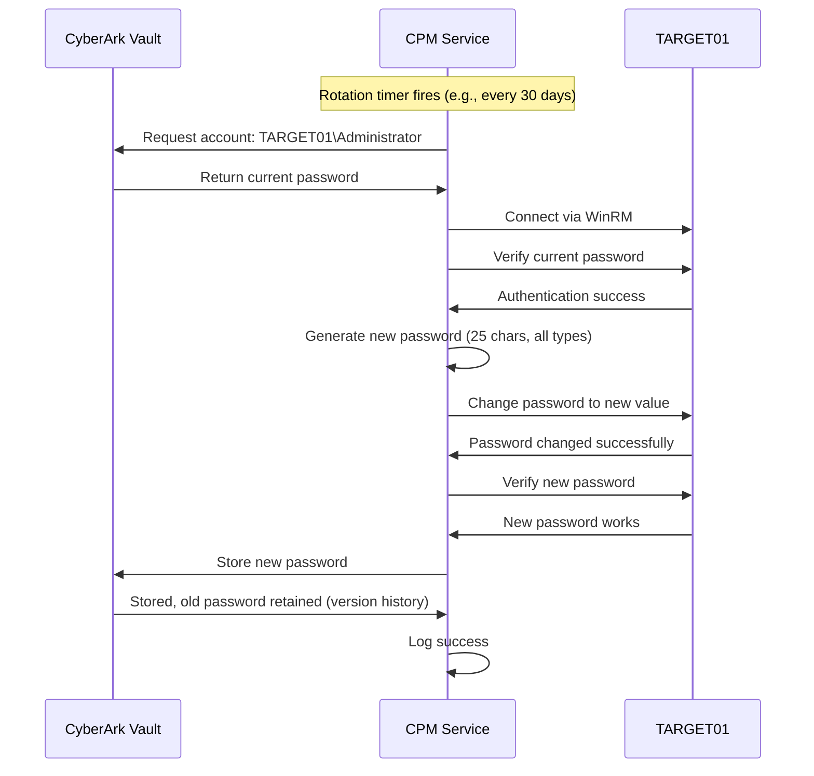
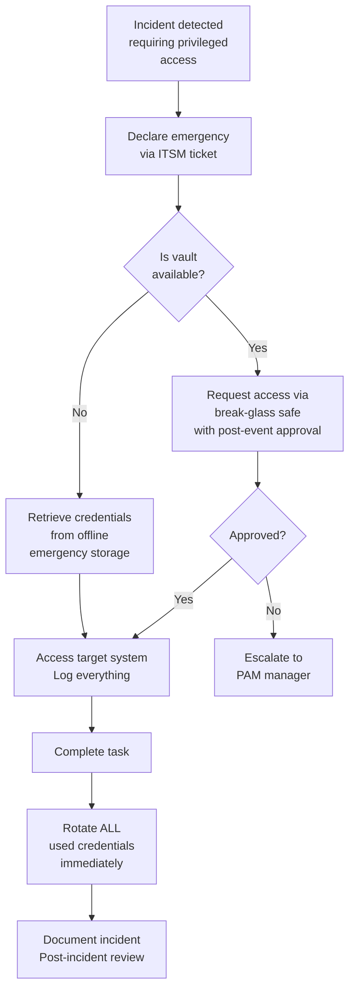

Your CyberArk environment is deployed and configured. Now it is time to use it. This guide covers the **day-to-day operational tasks** every CyberArk professional must know — onboarding accounts, managing passwords, monitoring sessions, handling emergencies, and generating audit evidence.

<Aside variant="info" title="Prerequisites">
Complete the **[CyberArk Lab Deployment](/learn/privileged-access-management/cyberark-lab-deployment/)** and **[First Steps](/learn/privileged-access-management/cyberark-first-steps/)** guides first. You need a running CyberArk environment with safes, a CPM policy, and PSM configured.
</Aside>

## What You Will Learn

1. Onboard a Windows local admin account into the vault
2. Test CPM password rotation
3. Configure and test PSM session proxying
4. Retrieve credentials via AIM (Application Identity Manager)
5. Use PACLI for command-line vault operations
6. Generate audit reports and evidence
7. Handle common operational scenarios
8. Configure break-glass emergency procedures

## Onboarding a Privileged Account

Onboarding — also called **platform onboarding** — is the process of adding a privileged account to the CyberArk vault so that CPM can manage its password. This is the single most common operational task in CyberArk administration.

### Understanding Platforms

Before onboarding, you must understand **Platforms**. A platform is a template that defines how CyberArk connects to and manages a specific type of target system. Each platform includes:

- **Connection parameters** — protocol, port, authentication method
- **Password management commands** — how CPM changes the password on that system type
- **Verification commands** — how CPM verifies the current password
- **Reconciliation commands** — how CPM fixes a password mismatch

CyberArk ships with dozens of pre-configured platforms. For your lab, the relevant ones are:

| Platform Name | Target Type | Connection Protocol |
|--------------|-------------|-------------------|
| `Windows Server Local Security` | Windows local accounts | WinRM / RPC |
| `Windows Domain User` | Active Directory domain accounts | LDAP / PowerShell |
| `Unix SSH Key` | Linux/Unix SSH key-based auth | SSH |
| `Unix Root` | Linux/Unix root accounts | SSH password |
| `Oracle Database` | Oracle DB accounts | SQL*Net |
| `Microsoft SQL Server` | SQL Server accounts | TDS |

<Steps>

### Step 1: Verify Connectivity to Target

Before onboarding, ensure the target server is reachable from the CPM:

```powershell
# On PVWA01 (where CPM runs), test connectivity to TARGET01
Test-NetConnection 192.168.100.40 -Port 445  # SMB
Test-NetConnection 192.168.100.40 -Port 5985 # WinRM HTTP
Test-NetConnection 192.168.100.40 -Port 5986 # WinRM HTTPS
```

If WinRM is not enabled on TARGET01, enable it:

```powershell
# On TARGET01, as Administrator
Enable-PSRemoting -Force
Set-Item WSMan:\localhost\Client\TrustedHosts -Value "PVWA01" -Force
Restart-Service WinRM
```

### Step 2: Navigate to Account Onboarding

In PVWA, go to **☰ Menu** → **Accounts** → **Add Account**.

### Step 3: Select Platform and Configure

Fill in the account details:

| Field | Value | Explanation |
|-------|-------|-------------|
| **Safe** | `LAB-Win-LocalAdmins` | Target safe for this account |
| **Platform** | `Windows Server Local Security` | Pre-configured platform for Windows local accounts |
| **Account Name** | `TARGET01\Administrator` | Display name in the vault |
| **Username** | `Administrator` | Local username on TARGET01 |
| **Address** | `192.168.100.40` | IP or hostname of the target server |
| **Password** | `T@rgetL0cal!2026` | Current password of the target account |
| **CPM Policy** | `LAB-Standard-Rotation-30` | The CPM policy to apply |

<Aside variant="tip" title="Address Resolution">
CyberArk can use either IP addresses or hostnames for target systems. Hostnames require proper DNS resolution. In your lab, using IP addresses is simpler since there is no production DNS. In production, always use FQDNs for consistency.
</Aside>

### Step 4: Configure Account Properties (Optional)

The **Account Properties** tab lets you add metadata that helps with management:

| Field | Value | Purpose |
|-------|-------|---------|
| **Owner** | `pamadmin@cyberark.lab` | Contact for this account |
| **Description** | `Built-in local admin on TARGET01` | Documentation of purpose |
| **Department** | `Lab` | Organisational grouping |
| **Location** | `Datacenter/Lab` | Physical or logical location |
| **Function** | `Infrastructure` | Business function of the target system |
| **Retain In Days** | `30` | Keep previous passwords for this many days (rollback capability) |

### Step 5: Set Access Permissions

By default, the user creating the account gets full permissions. Add additional users:

1. Click **Add Member**
2. Select `pamadmin` → Grant **Retrieve** and **List** permissions
3. Select `helpdesk_user` → Grant **Retrieve** only (operator access)

### Step 6: Submit the Account

Click **Save & Add Another** or **Save** to complete the onboarding.

After saving, CyberArk will:
1. Store the account credentials in the vault
2. Immediately verify the password against TARGET01
3. Schedule the first password rotation based on the CPM policy
4. Log the account addition in the audit trail

### Step 7: Verify the Onboarded Account

Navigate to **☰ Menu** → **Accounts** → Search for `TARGET01`.

You should see:

```
Account Name              │ Safe                  │ Platform            │ Status      │ Last Verified
──────────────────────────┼───────────────────────┼─────────────────────┼─────────────┼──────────────
TARGET01\Administrator    │ LAB-Win-LocalAdmins   │ Win Server Local    │ ✓ Verified  │ Just now
```

The status should show **Verified** with a green checkmark, confirming CPM successfully validated the password.

</Steps>

### Onboarding a Linux Root Account

To onboard a Linux target, repeat the process with:

| Field | Value |
|-------|-------|
| **Safe** | `LAB-Linux-Root` |
| **Platform** | `Unix Root (SSH)` |
| **Account Name** | `TARGET01-Linux\root` |
| **Username** | `root` |
| **Address** | `192.168.100.50` (if you have a Linux target) |
| **Password** | Current root password |
| **CPM Policy** | `LAB-Standard-Rotation-30` |

## Testing CPM Password Rotation

Once an account is onboarded, CPM will manage its password according to the assigned policy. You can trigger an immediate rotation to test the configuration.

### Trigger Manual Rotation

<Steps>

#### Navigate to the Account

In PVWA, go to **☰ Menu** → **Accounts** → Click on `TARGET01\Administrator`.

#### Initiate Password Change

Click the **Change Password** button (key icon) in the account toolbar.

#### Select Rotation Method

| Option | Description | When to Use |
|--------|-------------|-------------|
| **Immediately change password** | CPM generates a new password and applies it now | Testing, or if password is suspected compromised |
| **Change password at next scheduled rotation** | Wait for the scheduled interval | Routine operations |
| **Specify new password** | Manually provide the new password | Migration, or when target requires a specific password |

Select **Immediately change password**.

#### Monitor the Rotation

The rotation process takes 10-30 seconds. Watch the progress:

```
1. CPM reads current password from vault    ──→  ✓ Done
2. CPM connects to TARGET01 via WinRM       ──→  ✓ Connected
3. CPM verifies current password             ──→  ✓ Matches
4. CPM generates new password per policy     ──→  ✓ Generated (28 chars)
5. CPM changes password on TARGET01          ──→  ✓ Changed
6. CPM verifies new password on TARGET01     ──→  ✓ Works
7. CPM updates password in vault             ──→  ✓ Stored
8. CPM logs successful rotation              ──→  ✓ Logged
```

#### Verify the New Password

After rotation, retrieve the new password to confirm it changed:

1. On the account page, click **Copy Password**
2. The new password is copied to your clipboard
3. Try logging into TARGET01 with this password to verify:
   ```powershell
   # On TARGET01, switch to a different admin session, or use:
   # From another machine:
   # ssh/powershell into TARGET01 with the new password
   ```

#### Check CPM Logs

```powershell
# On PVWA01, check the CPM log for the rotation event
Get-Content "C:\CyberArk\CPM\Logs\CPM.log" -Tail 100 | Select-String -Pattern "TARGET01"
```

You should see entries confirming each step of the rotation process.

</Steps>

### What Happens During Automatic Rotation



## Configuring and Testing PSM Sessions

PSM provides proxied, recorded access to target systems. Instead of connecting directly to TARGET01, users connect through PSM, which injects the credential automatically and records the entire session.

### Configure PSM for Windows Connections

<Steps>

#### Verify PSM Platform

In PVWA, go to **☰ Menu** → **Platforms** → Search for `PSM_WinRemoteDesktop`.

This platform defines how PSM connects to Windows targets via RDP. It is pre-configured but verify the settings:

| Setting | Value | Should Match |
|---------|-------|-------------|
| **Platform** | `PSM_WinRemoteDesktop` | |
| **PSM Server** | `PVWA01` | The PSM server name |
| **Connection Component** | `PSM_RDP` | RDP connection component |
| **Target Resolution** | `Address` | Connect to account's address field |
| **Logon Account** | `Privileged` | Use the account being connected to |

#### Connect via PSM — Web Portal Method

1. Log into PVWA as `pamadmin`
2. Go to **☰ Menu** → **Accounts** → Select `TARGET01\Administrator`
3. Click the **Connect** button (monitor icon)
4. A connection file (`.rdp`) will be downloaded
5. Open the RDP file — PSM will:
   - Connect you through the PSM proxy
   - Inject the vault credentials automatically
   - Start session recording
   - Display a "Connected via CyberArk PSM" banner
6. You are now logged into TARGET01 as Administrator — **without ever seeing the password**

<Aside variant="caution" title="PSM Connection Requirements">
For PSM connections to work:
- RDP must be enabled on TARGET01
- TARGET01 must be reachable from PVWA01 on port 3389
- The PSM service must be running on PVWA01
- The target server must trust the PSM server's certificate (in production, use proper certificates; in the lab, accept the warning)
</Aside>

#### View Session Recording

1. In PVWA, go to **☰ Menu** → **Dashboard** → **Active Sessions**
2. You should see your current PSM session listed
3. After disconnecting, go to **☰ Menu** → **Accounts** → Select the account
4. Click **Session Recordings** tab
5. You will see a list of past sessions with duration, date, and user
6. Click **Play** to replay the session recording

</Steps>

### PSM SSH Connections

For Linux targets, CyberArk uses PSMP (Privileged Session Manager for SSH):

```bash
# From a Linux client that can reach the PSM server
# Install the SSH client if needed
ssh pamadmin@192.168.100.30 -p 2222

# When prompted, select the target:
# Target Address: 192.168.100.50
# Account: root

# PSMP will authenticate to the vault, retrieve the credential,
# and proxy the SSH session with full recording
```

## Using AIM for Application Credentials

AIM (Application Identity Manager) provides programmatic credential retrieval for applications and automation. This is how scripts, CI/CD pipelines, and scheduled tasks get credentials without hardcoding them.

### Configure AIM

<Steps>

#### Enable AIM in PVWA

1. Log into PVWA as `Administrator`
2. Go to **☰ Menu** → **Administration** → **Options**
3. Navigate to **Application Identity Manager** → **General**
4. Enable **AIM Web Service**
5. Set the AIM port (default: `8081`)
6. Click **Apply**

#### Verify AIM Service

```powershell
# On PVWA01, check that the AIM web service is running
Get-Service "CyberArk AIM" 
# If not running:
Start-Service "CyberArk AIM"

# Verify the AIM endpoint
Invoke-WebRequest -Uri "http://localhost:8081/AIMWebService/api/Accounts" -UseBasicParsing
```

#### Create an Application Identity

1. In PVWA, go to **☰ Menu** → **Applications** → **Add Application**
2. Configure:

| Field | Value | Explanation |
|-------|-------|-------------|
| **Application ID** | `MyLabApp` | Unique identifier for this application |
| **Description** | `Lab application for testing AIM access` | |
| **Location** | `\` | Root level |
| **Disabled** | `No` | Active from creation |

3. Configure **Authentication Methods**:

| Method | Value | When to Use |
|--------|-------|-------------|
| **Allowed Machines** | `192.168.100.0/24` | Restrict to lab network |
| **Client Certificate Required** | `No` | Lab only — enable in production |
| **OS User** | (leave empty) | Optional, restricts which OS user can call AIM |

4. Click **Save**

#### Grant Safe Access to the Application

1. Go to **☰ Menu** → **Safes** → `LAB-Service-Accounts`
2. Click **Members** → **Add Member**
3. Search for and select `MyLabApp`
4. Grant permissions:
   - **Access**: List accounts, Retrieve accounts
   - Do NOT grant Add, Update, or Delete (applications should only read)
5. Click **OK**

#### Test AIM Credential Retrieval

```powershell
# On PVWA01 (or any machine in 192.168.100.0/24), test AIM

# Using PowerShell
$response = Invoke-RestMethod -Uri `
  "http://localhost:8081/AIMWebService/api/Accounts?AppID=MyLabApp&Safe=LAB-Service-Accounts&Object=TARGET01%5CAdministrator"

Write-Output "Username: $($response.UserName)"
Write-Output "Password: $($response.Content)"

# Using curl
curl "http://localhost:8081/AIMWebService/api/Accounts?AppID=MyLabApp&Safe=LAB-Service-Accounts&Object=TARGET01%5CAdministrator"
```

The response includes the credential in JSON:

```json
{
  "Content": "G7$k2mN9#pQ4$xR8*vW1!zB6",
  "UserName": "TARGET01\\Administrator",
  "Address": "192.168.100.40",
  "Safe": "LAB-Service-Accounts",
  "Folder": "Root",
  "Object": "TARGET01\\Administrator",
  "PolicyID": "LAB-Standard-Rotation-30",
  "PasswordChangeInProcess": "False",
  "LastModified": "2026-06-15T10:30:00Z"
}
```

</Steps>

<Aside variant="danger" title="AIM Security in Production">
In production, the AIM endpoint must be **locked down**:
- Enable mutual TLS (client certificate authentication)
- Use IP allow-listing to restrict which machines can call AIM
- Never expose AIM to the internet
- Monitor AIM access logs for anomalous retrieval patterns
- Use short cache TTLs (300 seconds or less)
- Audit all credential retrievals in your SIEM
</Aside>

## Using PACLI — Command-Line Vault Operations

PACLI (Privileged Access Command Line Interface) is a command-line tool for vault operations. It is essential for automation and scripting.

### Basic PACLI Commands

```powershell
# Navigate to PACLI directory (installed with PVWA)
cd "C:\CyberArk\Vault"

# Initialize PACLI environment
.\PACLI.exe INIT

# Define vault definition
.\PACLI.exe DEFINEDVAULT -vault VAULT01 -ip 192.168.100.20 -port 1858

# Log into vault
.\PACLI.exe LOGON -vault VAULT01 -user Administrator -password V@ultAdmin!2026

# List all safes
.\PACLI.exe SAFESLIST -vault VAULT01

# List accounts in a safe
.\PACLI.exe ACCOUNTSLIST -vault VAULT01 -safe "LAB-Win-LocalAdmins"

# Get account details
.\PACLI.exe ACCOUNTDETAILS -vault VAULT01 -safe "LAB-Win-LocalAdmins" `
  -account "TARGET01\Administrator"

# Retrieve a password (requires reason)
.\PACLI.exe ACCOUNTPASSWORDGET -vault VAULT01 -safe "LAB-Win-LocalAdmins" `
  -account "TARGET01\Administrator" -reason "Operational test"

# Log off
.\PACLI.exe LOGOFF -vault VAULT01

# Terminate PACLI
.\PACLI.exe TERM
```

### PACLI for Automation

PACLI is frequently used in scripts for automated operations:

```powershell
# Automated password retrieval script
$vault = "VAULT01"
$user = "pamadmin"
$password = "P@mAdmin!2026"
$safe = "LAB-Service-Accounts"
$account = "SQLSvc_Prod"
$reason = "Scheduled backup job"

cd "C:\CyberArk\Vault"
.\PACLI.exe INIT
.\PACLI.exe DEFINEDVAULT -vault $vault -ip 192.168.100.20 -port 1858
.\PACLI.exe LOGON -vault $vault -user $user -password $password
$result = .\PACLI.exe ACCOUNTPASSWORDGET -vault $vault -safe $safe `
  -account $account -reason $reason
.\PACLI.exe LOGOFF -vault $vault
.\PACLI.exe TERM

Write-Output $result
```

## Generating Audit Reports

Audit evidence is a primary output of any PAM system. CyberArk provides built-in reports for compliance.

### Built-in Reports

In PVWA, go to **☰ Menu** → **Reports** to access:

| Report | Compliance Use | Description |
|--------|---------------|-------------|
| **Privileged Account Activity** | General audit | Who accessed which account, when, and why |
| **Password Changes** | SOX, PCI DSS | Audit trail of all password rotations |
| **Safe Membership** | SOX, ISO 27001 | Who has access to which safes |
| **Users and Groups** | SOX, HIPAA | Complete user inventory with roles |
| **CPM Activity** | Operational | CPM verification and rotation activity |
| **Sessions Activity** | PCI DSS, HIPAA | All PSM session recordings and metadata |

### Generate an Activity Report

1. Go to **☰ Menu** → **Reports** → **Privileged Account Activity**
2. Set date range (e.g., last 7 days)
3. Select safe (or leave blank for all)
4. Click **Generate**
5. Export as PDF or CSV for audit evidence

### View Audit Log

The **Audit** section shows every action in the vault:

1. Go to **☰ Menu** → **Audit**
2. Filter by:
   - **Date Range**: Last 24 hours
   - **Action**: Password retrieval
   - **User**: pamadmin
3. You should see all your test retrievals logged with timestamps and reasons

## Emergency Break-Glass Procedures

Despite all automation, there will be scenarios where normal CyberArk access is unavailable. Break-glass procedures ensure you can still access critical systems during emergencies.

### Break-Glass Scenarios

| Scenario | Impact | Break-Glass Action |
|----------|--------|-------------------|
| Vault unavailable | Cannot check out credentials | Use pre-stored emergency account envelopes |
| CPM offline | Passwords not rotating | Manual password changes, log all actions |
| PSM unavailable | Cannot connect via proxy | Direct RDP/SSH (with manual approval) |
| PVWA unavailable | No web interface | PACLI from vault-accessible machine |
| Vault completely lost | All credentials inaccessible | Restore from backup, use emergency safe |

### Configuring a Break-Glass Safe

Break-glass accounts are stored in a safe with **no automatic password management** (manual rotation only). This ensures the password does not change without explicit human action.

1. Go to **☰ Menu** → **Safes** → **LAB-BreakGlass**
2. Verify these settings:
   - **Allow automatic password management**: ❌ Disabled
   - **Password rotation**: Manual only
   - **Members**: Vault Admin only (plus maybe 1 emergency contact)
   - **Dual control**: ❌ Disabled (speed over control in emergencies)

### Onboarding Break-Glass Accounts

```powershell
# Onboard the vault's own Administrator account as a break-glass entry
# This is critical — if you lose the vault admin password, you lose everything
```

In the `LAB-BreakGlass` safe, add:

| Account | Username | Password | Notes |
|---------|----------|----------|-------|
| `VAULT01-VaultAdmin` | Administrator | V@ultAdmin!2026 | Vault break-glass |
| `TARGET01-Emergency` | .\Administrator | T@rgetL0cal!2026 | Server break-glass |
| `DC01-DomainAdmin` | CYBERARK\Administrator | L@bAdmin!2026 | Domain break-glass |

Store the break-glass credentials in a sealed envelope or encrypted password manager outside of CyberArk.

### Break-Glass Procedure



## Common Operational Tasks Reference

### How to: Find an Account

```bash
# In PVWA: ☰ Menu → Accounts → Search box
# Search by: Account name, username, address, safe, or platform

# Using PACLI:
PACLI.exe ACCOUNTSLIST -vault VAULT01 -safe "LAB-Win-LocalAdmins"
```

### How to: Retrieve a Password

```bash
# In PVWA: Accounts → Select account → "Copy Password" or "Show Password"
# Both actions require a reason and are logged in the audit trail

# Using PACLI:
PACLI.exe ACCOUNTPASSWORDGET -vault VAULT01 -safe "LAB-Win-LocalAdmins" -account "TARGET01\Administrator" -reason "Routine maintenance"
```

### How to: Add a New Safe Member

```bash
# In PVWA: Safes → Select safe → Members → Add Member
# Select user/group → Grant specific permissions → OK
```

### How to: Modify a CPM Policy

```bash
# In PVWA: Policies → Select policy → Edit
# Change rotation frequency, complexity, or assigned safes → Save
# Changes apply at the next scheduled rotation
```

### How to: Manually Trigger Password Verification

```bash
# In PVWA: Accounts → Select account → Verify Password
# CPM will immediately check the password against the target
```

### How to: View Session Recording

```bash
# In PVWA: Accounts → Select account → Session Recordings tab
# Select a session → Play
# Use the player controls: pause, skip, speed control
```

### How to: Disable an Account (without deleting)

```bash
# In PVWA: Accounts → Select account → Disable
# The account remains in the vault but CPM stops managing it
# No one can check out the password while disabled
```

### How to: Delete an Account

```bash
# In PVWA: Accounts → Select account → Delete
# WARNING: This permanently removes the account from the vault
# Only delete when the account no longer exists on the target
```

## Troubleshooting Common Operational Issues

### CPM Password Change Fails

| Error | Likely Cause | Solution |
|-------|-------------|----------|
| "Cannot connect to target" | Network issue, target offline | Verify `Test-NetConnection TARGET01 -Port 5985` |
| "Access denied" | CPM account lacks permissions on target | Ensure `svc-cpm` is in target's Administrators group (or add CPM account explicitly) |
| "Password complexity not met" | Target enforces different rules | Either adjust CPM policy or modify target's password policy |
| "Account locked" | Too many failed attempts | Unlock the account on the target, then verify in CPM |
| "Time out" | Network latency or target overloaded | Increase CPM connection timeout setting in the platform |

### PSM Connection Fails

| Error | Likely Cause | Solution |
|-------|-------------|----------|
| "PSM server not available" | PSM service not running | `Start-Service "CyberArk PSM"` on PVWA01 |
| "Cannot connect to target" | Target RDP port not reachable | Enable RDP on TARGET01: `Enable-NetFirewallRule -DisplayGroup "Remote Desktop"` |
| "Authentication failed" | PSM cannot retrieve credential | Verify account exists in vault and user has retrieve permission |
| "PSM not registered" | PSM not registered with vault | Run `PSMRegistrationTool.exe -Register` on PVWA01 |

### AIM Issues

| Error | Likely Cause | Solution |
|-------|-------------|----------|
| "HTTP 401 Unauthorized" | Application ID not found | Verify AppID in Applications page matches the request |
| "No accounts found" | Safe access not granted | Check that the Application has access to the specific safe |
| "AIM service not responding" | AIM service not running | `Start-Service "CyberArk AIM"` |

## Operations Checklist

Use this checklist to confirm operational readiness:

| # | Task | Status | Verification |
|---|------|--------|-------------|
| 1 | Onboard Windows local admin account | ☐ | Account shows "Verified" in PVWA |
| 2 | Trigger and verify manual password rotation | ☐ | Password changes, CPM logs success |
| 3 | Connect via PSM (RDP) | ☐ | Session recording available in PVWA |
| 4 | Retrieve credential via AIM | ☐ | REST API returns valid JSON with password |
| 5 | Run PACLI command to list safes | ☐ | Safes list returned without errors |
| 6 | Generate activity report | ☐ | PDF/CSV export contains expected data |
| 7 | Check audit log for recent activity | ☐ | All test actions visible in audit trail |
| 8 | Onboard second account (different type) | ☐ | Second account verified and managed |
| 9 | Test break-glass safe access | ☐ | Manual credentials accessible in emergency safe |
| 10 | Verify CPM daily verification runs | ☐ | CPM log shows daily verification entries |

## Key Takeaways

- **Account onboarding is the most frequent operational task** — select the correct platform, safe, and CPM policy for each account type
- **CPM automates the entire password lifecycle** — verification, rotation, reconciliation — but must be tested after each configuration change
- **PSM provides zero-knowledge access** — users connect through the proxy without ever seeing the password, and every keystroke is recorded
- **AIM enables secure automation** — applications and scripts retrieve credentials programmatically without hardcoding secrets
- **PACLI is essential for automation and recovery** — when PVWA is unavailable, PACLI is the command-line backup access method
- **Break-glass procedures must be documented and tested** — emergencies will happen, and the plan must be proven before it is needed
- **Audit logs are the compliance deliverable** — every action in CyberArk generates an audit record; ensure they are centralised in your SIEM

<Aside variant="info" title="Next Steps">
You have now deployed, configured, and operated CyberArk. The same operational patterns apply to onboarding additional account types — database accounts, cloud IAM users, network devices, and SSH keys. Explore the **Platforms** section in PVWA to see the full range of supported target systems.
</Aside>
