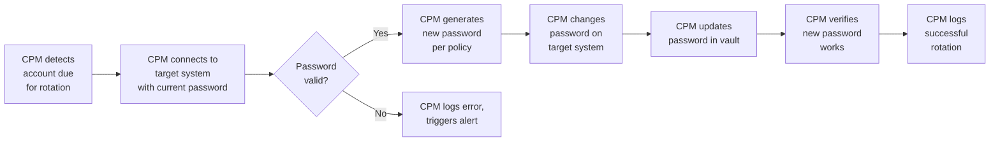
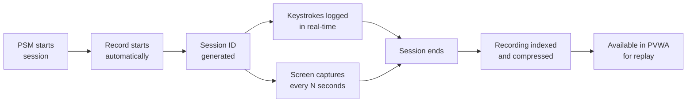
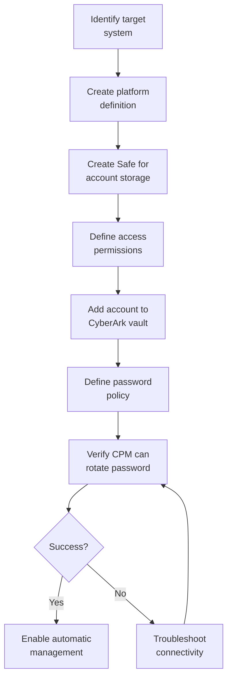

CyberArk is the market-leading Privileged Access Management platform, deployed by over half of the Fortune 500. As a PAM professional, you will likely encounter CyberArk in enterprise environments ranging from mid-size organisations to the largest global banks and government agencies.

This page provides a comprehensive overview of the CyberArk platform — its architecture, core components, operational workflows, and best practices.

<Aside variant="info" title="Hands-On Lab Guides">
Ready to get practical? This overview page covers the architecture and concepts. For step-by-step deployment and operations, follow the dedicated hands-on guides:

1. **[CyberArk Lab Deployment](/learn/privileged-access-management/cyberark-lab-deployment/)** — Set up a complete CyberArk lab with Vault, PVWA, CPM, and PSM
2. **[CyberArk First Steps](/learn/privileged-access-management/cyberark-first-steps/)** — First login, safe creation, user management, CPM policy configuration
3. **[CyberArk Operations](/learn/privileged-access-management/cyberark-operations/)** — Onboard accounts, test password rotation, configure PSM, use AIM, generate reports
</Aside>

## CyberArk Architecture Overview

CyberArk follows a component-based architecture where each function is handled by a dedicated component, all centred around the **Digital Vault**.

```
                            ┌─────────────────────────┐
                            │    PVWA (Web Interface)  │
                            │    Password Vault Web    │
                            │    Access                │
                            └────────────┬────────────┘
                                         │
    ┌──────────────┐    ┌────────────────┼────────────────┐    ┌──────────────┐
    │   CPM        │    │                │                │    │    AIM       │
    │ Central      │    │    Digital     │                │    │ Application  │
    │ Policy       │◄───┤    Vault       ├────────────────►───┤ Identity     │
    │ Manager      │    │   (D-Vault)    │                │    │ Manager      │
    └──────────────┘    └────────────────┘                │    └──────────────┘
                                                          │
    ┌──────────────┐    ┌────────────────┐                │    ┌──────────────┐
    │   PSM        │    │    PTA         │                │    │   Conjur     │
    │ Privileged   │    │ Privileged     │                │    │ Secrets      │
    │ Session      │    │ Threat         │                │    │ Management   │
    │ Manager      │    │ Analytics      │                │    │ (K8s/DevOps) │
    └──────────────┘    └────────────────┘                │    └──────────────┘
```

### Component Roles

| Component | Full Name | Function |
|-----------|-----------|----------|
| **Digital Vault** | CyberArk Vault | Central credential storage — encrypted database of all privileged accounts |
| **PVWA** | Password Vault Web Access | Web-based administrative interface and user portal |
| **CPM** | Central Policy Manager | Password rotation, policy enforcement, account verification |
| **PSM** | Privileged Session Manager | Session proxy for recording and monitoring privileged sessions |
| **PSMP** | Privileged Session Manager for SSH | SSH session proxy (Linux/Unix) |
| **AIM** | Application Identity Manager | API-based credential injection for applications |
| **PTA** | Privileged Threat Analytics | Behavioural analytics and threat detection for privileged activity |
| **Conjur** | Conjur Secrets Management | DevOps secrets management for container and cloud-native environments |
| **EPV** | Enterprise Password Vault | Legacy name for the core vault component |

## The Digital Vault

The Digital Vault is the heart of CyberArk — a hardened, encrypted repository for all privileged credentials.

### Vault Structure

```
Vault
├── Safes (logical containers for credential storage)
│   ├── Safe: Windows-Local-Admin
│   │   ├── Account: SERVER01\Administrator
│   │   ├── Account: SERVER02\Administrator
│   │   └── Account: WORKSTATION001\Administrator
│   ├── Safe: Linux-Root
│   │   ├── Account: db-server-01\root
│   │   └── Account: web-server-01\root
│   ├── Safe: Service-Accounts
│   │   ├── Account: SQLSvc_Prod
│   │   └── Account: WebSvc_Prod
│   └── Safe: Domain-Admins
│       └── Account: CORP\krbtgt_backup
│
├── Policies (access control and password management)
│   ├── Policy: High-Risk-Servers
│   ├── Policy: Standard-Servers
│   └── Policy: Service-Accounts-90day
│
└── Users (administrators, end-users, application identities)
    ├── User: alice (Vault Admin)
    ├── User: bob (Security Team)
    ├── User: helpdesk (Operator)
    └── User: monitoring-app (API User)
```

### Vault Hardening

CyberArk vaults are hardened Linux servers with specific security measures:

- **Minimal OS footprint** — Only required services installed
- **FIPS 140-2 encryption** — AES-256 for stored credentials, TLS 1.2+ for transit
- **Dual Control** — Administrative actions require two-person approval
- **Separation of Duties** — Vault admin ≠ Audit ≠ Policy admin
- **Hardened SSH** — Key-based auth only, no root SSH, IP-restricted
- **RAID 10 + Hot Spare** — Disk-level redundancy
- **Backup to encrypted external media** — Regular scheduled backups

## Password Vault Web Access (PVWA)

PVWA is the primary interface for administrators, operators, and end-users.

### User Roles

| Role | Permissions | Typical User |
|------|-------------|-------------|
| **Vault Admin** | Full system configuration, user management, policy creation | PAM team lead |
| **Safe Admin** | Manage specific safes, onboard accounts, define access | PAM administrator |
| **Security Admin** | Audit, reporting, threat analysis | Security operations |
| **Operator** | Check out passwords, request access, no configuration | Helpdesk, server admins |
| **User** | Request access to specific accounts | Application owners |
| **Application Identity** | API-based credential retrieval via AIM | DevOps, automation |

### Common PVWA Workflows

```
Password Checkout (Manual)
─────────────────────────
1. User logs into PVWA
2. User searches for account (e.g., "db-prod-sa")
3. User selects account and clicks "Copy Password" or "Connect"
   (Option: Enter reason code for access justification)
4. Vault records access in audit log
5. User receives clipboard copy or connection file
6. If "Require Reason" enforced: compliance automatically logged

Password Checkin
───────────────
1. User completes task
2. User clicks "Check In" in PVWA (or closes PSM session)
3. CPM automatically rotates password (if policy requires)
4. New password is stored in vault
5. Old password is purged (no recovery possible)
```

## Central Policy Manager (CPM)

CPM is responsible for password management — verification, rotation, reconciliation, and policy enforcement.

### CPM Workflows



### CPM Policy Configuration

| Policy Setting | Options | Recommendation |
|---------------|---------|---------------|
| **Rotation Period** | 1-365 days | 30 days for local admin, 90 days for service accounts |
| **Password Complexity** | Upper, Lower, Digits, Special | All four character types |
| **Password Length** | 8-100 characters | 25+ for interactive accounts, 50+ for service accounts |
| **Reconcile Period** | 1-365 days | 1 day (daily verification) |
| **Post-Rotation Action** | None, Verify, Verify Only | Full verify |
| **Platforms** | Windows, Linux, Database, AD, etc. | Platform-specific drivers |

### CPM Platforms

CPM uses "Platforms" — connector definitions for different target system types:

| Platform Category | Examples | Connection Method |
|------------------|----------|-----------------|
| **Windows** | Local admin, Domain admin, Service account | WinRM, RPC, WMI |
| **Unix/Linux** | Root, Application user | SSH |
| **Database** | Oracle, SQL Server, MySQL, PostgreSQL | Native DB protocol |
| **Directory** | Active Directory, LDAP | LDAP, PowerShell |
| **Cloud** | AWS IAM, Azure AD, GCP | Cloud API |
| **Network** | Cisco, Juniper, Palo Alto | SSH, Telnet |
| **Custom** | Any system with API | Custom plugin (Python, PowerShell) |

## Privileged Session Manager (PSM)

PSM provides a secure proxy for privileged sessions, enabling recording, monitoring, and granular access control.

### PSM Session Flow

```
User ──→ PVWA ──→ PSM ──→ Target System
          │        │
          │    ┌───┴───┐
          │    │Record │
          │    │Monitor│
          │    │Control│
          │    └───────┘
          │
     Credential
     (never seen
      by user)
```

**Key capabilities:**
- **Credential injection** — User never sees the password
- **Full session recording** — Keystroke and screen capture (RDP, SSH)
- **Real-time monitoring** — Live session viewing by security team
- **Session termination** — Security team can kill suspicious sessions
- **Granular command control** — Allow/block specific commands on SSH sessions
- **File transfer control** — Upload/download restrictions

### PSM Connection Methods

| Protocol | PSM Component | Recording Quality | Target Types |
|----------|--------------|-------------------|--------------|
| **RDP** | PSM-RDP | Full screen + keystroke | Windows servers, workstations |
| **SSH** | PSM-SSH or PSMP | Keystroke + output | Linux, Unix, Network devices |
| **WinSCP** | PSM-SCP | File transfer log | Windows file servers |
| **Database** | PSM-DB | SQL query recording | Oracle, SQL Server, MySQL |

### Session Recording Management



## Application Identity Manager (AIM)

AIM provides programmatic access to vault credentials for applications, scripts, and automation tools.

### AIM Architecture

```
Application ──→ AIM Console ──→ Vault
    │               │
    │          ┌────┴────┐
    │          │  Cache  │
    │          │  Local  │
    │          └─────────┘
    │
    ▼
Credential obtained
(via REST API or
AIM SDK)
```

### AIM Credential Retrieval

```bash
# REST API call to retrieve credential
curl -X POST \
  -H "Content-Type: application/x-www-form-urlencoded" \
  -d 'AppID=MyWebApp&Safe=Service-Accounts&Folder=Root&Object=WebSvc_Prod' \
  https://aim-server:8081/AIMWebService/api/Accounts

# Response
{
  "Content": "S3cur3P@ssw0rd!2026",
  "UserName": "CORP\\WebSvc_Prod",
  "Address": "sql-prod-01.corp.com",
  "Folder": "Root",
  "Safe": "Service-Accounts"
}
```

### AIM Security

| Feature | Purpose |
|---------|---------|
| **Mutual authentication** | Both client and server verify identity |
| **IP allow-listing** | Restrict AIM access to specific servers |
| **Certificate-based auth** | Application identity via client certificates |
| **Local caching** | Reduces vault load, provides fallback |
| **Cache expiration** | Cached credentials expire after configurable TTL |
| **Audit logging** | Every credential retrieval is logged |

## Platform Onboarding Workflow

The standard process for bringing a new target system under CyberArk management:



## Privileged Threat Analytics (PTA)

PTA provides behaviour-based threat detection for privileged activity.

### PTA Detection Capabilities

| Detection | Description | Example |
|-----------|-------------|---------|
| **Anomalous credential use** | Account used from unusual location or time | Domain Admin login from non-US IP |
| **Session fingerprinting** | Unusual command sequences in SSH sessions | `wget` followed by `chmod +x` |
| **Lateral movement** | Same credential used on multiple systems rapidly | Service account hopping across 10 servers in 2 minutes |
| **Privilege escalation** | Account receives unexpected privileges | Standard user added to Domain Admins |
| **Credential theft** | Multiple failed access attempts followed by success | Password spraying detected |

## Operational Best Practices

### Vault Administration

- **Rule of least privilege** — Users get only the safes and accounts they need
- **Dual control** — Require two approvers for sensitive account access
- **Separation of duties** — No single person should be Vault Admin + Safe Admin + Audit
- **Master Password** — Split the vault master password using Shamir's Secret Sharing
- **Regular DR testing** — Quarterly vault recovery drills

### Password Policies

| Account Type | Rotation Interval | Password Length | Character Types |
|-------------|------------------|----------------|-----------------|
| Local Administrator | 30 days | 25 characters | All 4 types |
| Domain Admin | 30 days | 30 characters | All 4 types |
| Service Account | 90 days | 50 characters | All 4 types |
| Application Account | 90 days | 50 characters | All 4 types |
| Network Device | 30 days | 20 characters | All 4 types |
| Database Account | 30 days | 30 characters | All 4 types |

### Monitoring and Alerting

| Alert | Severity | Response |
|-------|----------|----------|
| CPM password change failure | High | Investigate immediately — account may be locked |
| Concurrent session from multiple locations | Critical | Possible credential compromise |
| Account accessed outside business hours | Medium | Verify with account owner |
| PSM session with blocked command | High | Review session recording |
| Vault backup failure | Critical | Resolve within 4 hours |
| Master password not rotated in 12 months | Medium | Schedule rotation |

### Integration Patterns

| System | Integration Method | Purpose |
|--------|-------------------|---------|
| **SIEM (Splunk, Sentinel, QRadar)** | Syslog, CEF | Centralised privileged activity monitoring |
| **ITSM (ServiceNow, Jira)** | REST API | Access request and approval workflows |
| **IAM/IGA (SailPoint, Saviynt)** | SCIM, REST API | Birthright access and certification |
| **AD / LDAP** | LDAP, PowerShell | User authentication and group membership |
| **MFA (RSA, Duo, MS Authenticator)** | RADIUS, SAML | Step-up authentication for vault access |
| **HCM (Workday, SAP)** | SCIM, CSV import | Automated user provisioning from HR data |

## Hands-On Learning Path

This overview page covered CyberArk architecture and concepts. Now put that knowledge into practice:

| Guide | What You Will Learn | Time |
|-------|-------------------|------|
| **[CyberArk Lab Deployment →](/learn/privileged-access-management/cyberark-lab-deployment/)** | Set up 4 VMs, deploy Vault, install PVWA/CPM/PSM | 3-4 hours |
| **[CyberArk First Steps →](/learn/privileged-access-management/cyberark-first-steps/)** | First login, create safes, configure CPM, LDAP setup | 1-2 hours |
| **[CyberArk Operations →](/learn/privileged-access-management/cyberark-operations/)** | Onboard accounts, rotate passwords, PSM sessions, AIM | 1-2 hours |

## Key Takeaways

- **CyberArk is not a single product** — it is a platform of integrated components (Vault, CPM, PSM, AIM, PTA)
- **The Vault is the foundation** — all other components depend on the vault's security and availability
- **CPM automates password hygiene** — regular rotation eliminates the risks of static credentials
- **PSM solves the "zero-knowledge" problem** — users access targets without ever seeing the password
- **Platform onboarding is the core operational skill** — knowing how to add and manage accounts in CyberArk
- **Audit is non-negotiable** — CyberArk generates rich audit data; centralise it in a SIEM for continuous monitoring
- **Master password management is critical** — losing vault access means losing all privileged credentials
