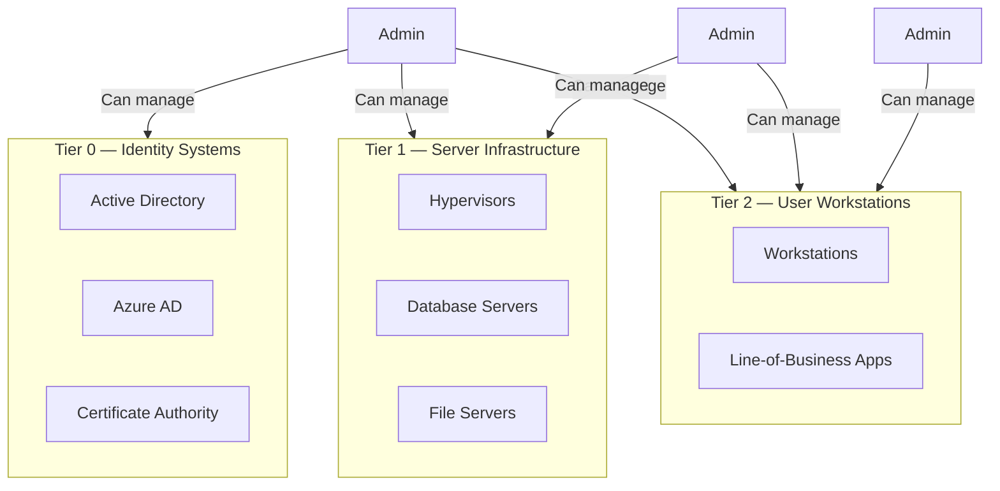

PAM architecture defines how privileged access management components are deployed, integrated, and scaled across the enterprise. A well-designed PAM architecture balances security (least privilege, segmentation) with operational requirements (availability, performance, user experience).

This page covers the key architectural patterns, decisions, and integration points for enterprise PAM deployments.

## PAM Deployment Models

### Tier 1: Basic Credential Vaulting

The simplest PAM architecture — a central vault stores privileged credentials, and administrators check them out on demand.

```
Admin ──→ Vault (credential checkout) ──→ Target System
```

**Best for**: Small organisations (< 500 employees), basic compliance requirements.
**Limitations**: No session monitoring, no JIT, no proxy.

### Tier 2: Vault + Session Proxy

Adds a session proxy through which all privileged sessions are routed, recorded, and monitored.

```
Admin ──→ Vault (credential checkout) ──→ Session Proxy ──→ Target System
                                              │
                                         Recording
                                         Monitoring
```

**Best for**: Mid-size organisations (500-5000 employees), SOX/PCI compliance.
**Limitations**: No JIT, limited automation.

### Tier 3: Full PAM Platform

Integrates vaulting, session management, JIT access, discovery, and governance into a unified platform.

```
Admin ──→ PAM Portal (request access) ──→ Approval Workflow ──→ JIT Elevation ──→ Session Proxy ──→ Target
          │                                │                    │                    │
          Vault                            Approval              AD group            Recording
          (credential storage)              Engine               membership           Engine
```

**Best for**: Large enterprises (5000+ employees), regulated industries, hybrid cloud.

### Tier 4: Zero Standing Privileges

No user has permanent privileged access. All privilege is ephemeral, JIT-approved, and automatically expires.

```
Admin ──→ JIT Request ──→ Approval ──→ Temporary Elevation ──→ Time-bound Session ──→ Auto-De-escalation
          (no standing          (workflow)    (15 min-4 hours)    (monitored)              (privilege
           privs)                                                                          removed)
```

**Best for**: Mature security programs, Zero Trust architectures, high-risk environments.

## PAM Tiering Model (Microsoft Enterprise Access Model)

Microsoft defines a tiering model for privileged access that is widely adopted:

| Tier | Systems | Access Requirements | PAM Controls |
|------|---------|---------------------|--------------|
| **Tier 0** | Identity systems (AD, Azure AD, PKI, CA) | Extreme — highest security | Dedicated PAW, FIDO2 MFA, no internet, session recording all access |
| **Tier 1** | Server infrastructure (hypervisors, file servers, databases) | High — server administration | PAW recommended, MFA required, JIT access, session recording |
| **Tier 2** | User workstations and devices | Standard administration | MFA required, least privilege, application allowlisting |

**Tiering rule**: Administrators in Tier 0 can manage Tier 0, Tier 1, and Tier 2. Administrators in Tier 1 can only manage Tier 1 and Tier 2. Administrators in Tier 2 can only manage Tier 2.



## High Availability Architecture

### Vault HA Deployment

```
                   ┌─────────────────────┐
                   │  Load Balancer      │
                   │  (VIP / DNS)        │
                   └──────┬──────────────┘
                          │
          ┌───────────────┼───────────────┐
          │               │               │
    ┌─────┴─────┐   ┌─────┴─────┐   ┌─────┴─────┐
    │ Vault     │   │ Vault     │   │ Vault     │
    │ Node 1    │   │ Node 2    │   │ Node 3    │
    │ (Primary) │   │ (Replica) │   │ (Replica) │
    └─────┬─────┘   └─────┬─────┘   └─────┬─────┘
          │               │               │
          └───────────────┼───────────────┘
                          │
                    ┌─────┴─────┐
                    │  Database │
                    │ (HA/DR)   │
                    └───────────┘
```

**HA requirements**:
- Minimum 3 vault nodes for production
- Active-passive or active-active configuration
- Database cluster (SQL Server Always On, PostgreSQL Patroni)
- Geographic redundancy for DR (active in primary region, passive in secondary)
- Automatic failover with RTO < 5 minutes, RPO < 1 minute

## Integration Patterns

### IAM Integration

| Integration | Purpose | Method |
|-------------|---------|--------|
| **Identity feed** | Synchronise user accounts and groups from IAM to PAM | SCIM, LDAP sync, API |
| **SSO to PAM portal** | Users authenticate to the PAM system using their corporate identity | SAML 2.0, OIDC |
| **RBAC for PAM** | Map IAM roles to PAM access policies | Role mapping, group-based access |
| **HR integration** | Automatically deprovision PAM access when employee terminates | HR system → IAM → PAM |

### SIEM Integration

| Data Type | Forwarding Method | Use Case |
|-----------|------------------|----------|
| **Vault access logs** | Syslog, Splunk HEC, CEF | Who accessed which credential when |
| **Session metadata** | Syslog, API | Session start, end, duration, source/dest |
| **Command logs** | Syslog, file forwarder | What commands were executed during privileged sessions |
| **Alert events** | Syslog, email, webhook | Policy violations, suspicious activity |
| **Session recordings** | API or file share | On-demand retrieval of recorded sessions for investigation |

### ITSM Integration

| Integration | Method | Benefit |
|-------------|--------|---------|
| **Ticket-based access** | PAM validates change ticket before granting elevation | Ensures all privileged access is authorised |
| **Auto-approval** | PAM approves elevation request when ticket status is "Approved" | Reduces manual approval friction |
| **Post-session update** | PAM updates change ticket with session details after completion | Complete audit trail from request to execution |

## Architecture Decision Framework

| Decision | On-Premises | Cloud / SaaS | Hybrid |
|----------|-------------|--------------|--------|
| **Vault location** | Data centre | Vendor cloud | Split |
| **Session proxy** | On-prem jump hosts | Cloud proxy | Both |
| **Managed targets** | On-prem servers | Cloud resources | All |
| **HA strategy** | Active-passive | Multi-AZ | Multi-region |
| **Compliance** | Full control | Vendor compliance | Split responsibility |
| **Operational overhead** | High | Low | Medium |
| **Latency** | Low (local) | Variable (internet) | Variable |
| **Best for** | Air-gapped, regulated | Cloud-native, small teams | Large enterprises |

<Aside variant="tip">
Most enterprises should adopt a **cloud-first PAM architecture** — deploy the PAM control plane (vault, session proxy) in the cloud, with on-premises agents/bridges for legacy systems that cannot connect to the cloud. This provides the best balance of operational efficiency and comprehensive coverage.
</Aside>

## PAM Sizing Guidelines

| Metric | Small (< 500 users) | Medium (500-5000) | Large (5000-50000) | Enterprise (50000+) |
|--------|-------------------|-------------------|--------------------|---------------------|
| **Managed accounts** | 100-500 | 500-5000 | 5000-50000 | 50000+ |
| **Concurrent sessions** | 5-10 | 10-50 | 50-200 | 200-1000 |
| **Vault nodes** | 1 (no HA) | 2-3 | 3-5 | 5+ |
| **Database** | Embedded | Dedicated server | Clustered | Geo-distributed |
| **Storage (recordings)** | 500 GB | 1-5 TB | 5-50 TB | 50+ TB |
| **Dedicated PAM team** | Part-time (0.5 FTE) | 1-2 FTEs | 3-5 FTEs | 5+ FTEs |

## Key Takeaways

- PAM architecture spans four maturity tiers: basic vaulting → vault + proxy → full platform → zero standing privileges
- The Microsoft Enterprise Access Model tiers systems (Tier 0: identity, Tier 1: infrastructure, Tier 2: workstations) — administrators in a higher tier can manage lower tiers but not vice versa
- High-availability architecture requires 3+ vault nodes, clustered database, and geographic redundancy with RTO < 5 minutes
- PAM integrates with IAM (identity sync, SSO, RBAC), SIEM (log forwarding, alerts, recordings), and ITSM (ticket validation, auto-approval, session updates)
- Architecture decisions (on-prem vs cloud vs hybrid) balance compliance, operational overhead, latency, and coverage — cloud-first is recommended for most enterprises
- PAM sizing depends on managed accounts, concurrent sessions, and storage requirements — scale from embedded database (small) to geo-distributed cluster (enterprise)
